# Nutzung von eScriptorium

> **Hinweis:** Diese Anleitung beschreibt die **neue Oberfläche** von eScriptorium (ab Version 1.0). Die ältere Legacy-Oberfläche (Versionen vor 1.0) wird in der [Nutzungsanleitung eScriptorium](./Nutzungsanleitung_eScriptorium.md) beschrieben.
>Die Anleitung basiert auf dem Blogbeitrag von Lectaurep: https://lectaurep.hypotheses.org/documentation/escriptorium-tutorial-en

>Eine ausführlichere und aktualisierte Dokumentation zu eScriptorium in englischer Sprache finden Sie unter: https://escriptorium.readthedocs.io/

## 1. Schritt für Schritt
### 1.1. Einloggen in eScriptorium
Sie loggen sich bei eScriptorium mit einem individuellen Konto ein, das aus einem Login, einem Passwort und einer E-Mail-Adresse besteht. Ein Konto wird vom Benutzer nach Erhalt einer Einladung oder vom Administrator der Website erstellt:

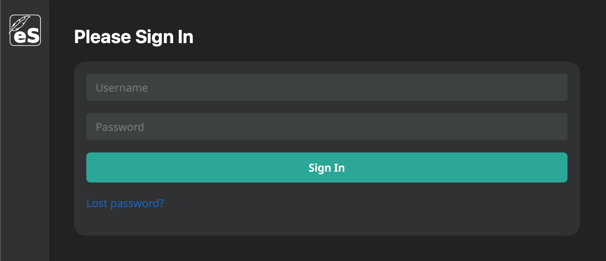

Sobald Sie eingeloggt sind, sehen Sie das Dashboard, welches Ihnen alle Dokumente, die Sie selbst erstellt haben und die mit ihnen geteilt wurden, anzeigt. Beim ersten Login ist das Dashboard leer.

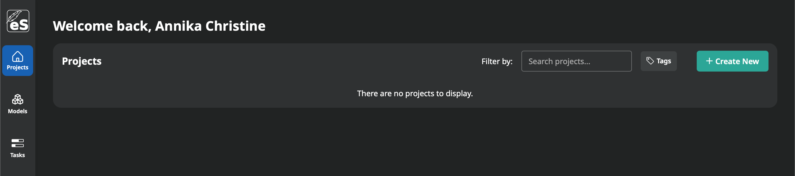

### 1.2. Ein neues Projekt anlegen
#### 1.2.1. Terminologie
- Ein **„Projekt“** umfasst ein oder mehrere Dokumente, die Sie diesem Projekt zugeordnet haben.

#### 1.2.2. Instruktionen
Um ein neues Projekt zu erstellen, klicken Sie auf den Button „Create New“, dadurch öffnet sich eine neue Seite auf der Sie den Namen des Projektes angeben müssen. Anschließend öffnet sich Ihr neues Projekt automatisch.

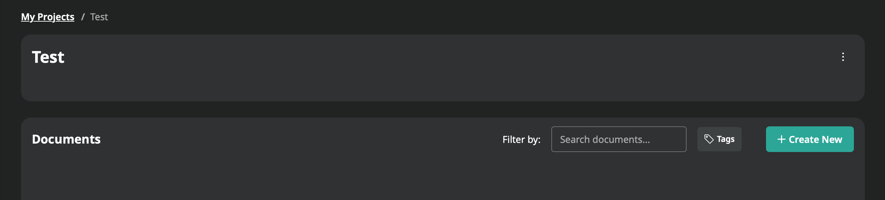

### 1.3. Ein neues Dokument anlegen
#### 1.3.1. Terminologie
- Ein **„Dokument“** ist eine Kollektion von Bildern, die eine Einheit bilden.
- Ein **„Teil-Dokument“**  ist ein Bild bzw. eine Seite, die Teil eines Dokumentes ist.

#### 1.3.2. Instruktionen
Um ein Dokument zu erstellen, klicken Sie innerhalb eines Projektes bei "Documents" auf den Button „Create New“, dadurch öffnet sich ein Eingabeformular:

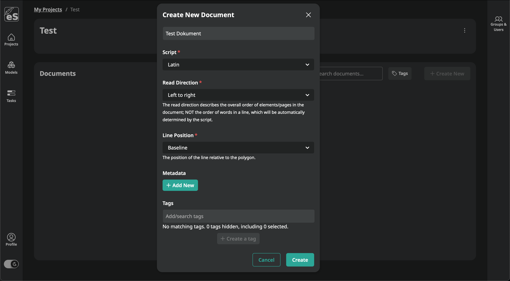

Die Felder „Name“, "Script", "Read Direction" und "Line Position" müssen ausgefüllt werden. Die übrigen Felder sind optional und können später ergänzt werden.

Nach der Eingabe der Informationen, klicken Sie auf "Create", um das Dokument zu erstellen. Anschließend wird das Dokument automatisch geöffnet. Die eingegebenen Daten können später immer noch angepasst werden: der „Create“-Button wird durch einen „Save“-Button ersetzt.

Um vom Dashboard wieder auf das Eingabeformular bzw. das zuletzt bearbeitete Element zu kommen, müssen Sie auf das Dokument klicken, um es zu öffnen. Wählen Sie anschließend "Edit" aus, um die Daten anzupassen.

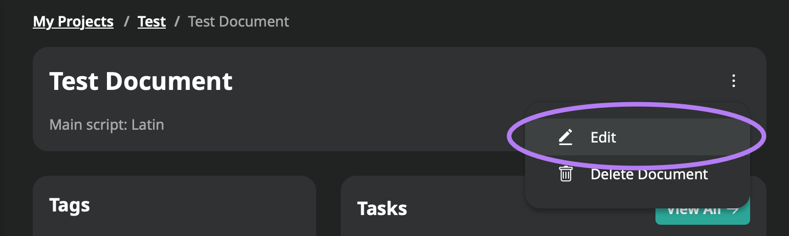

### 1.4. Bilder hochladen
#### 1.4.1. Zugriff auf das Interface
Unter der Schnittstelle „Bilder“ werden alle Anwendungen hinsichtlich der automatischen Bildverarbeitung sowie der Importe und Exporte verwaltet.
Um auf diese Schnittstelle zuzugreifen, klicken Sie innerhalb eines Dokumentes einfach bei "Your Recent Images" auf "View All".

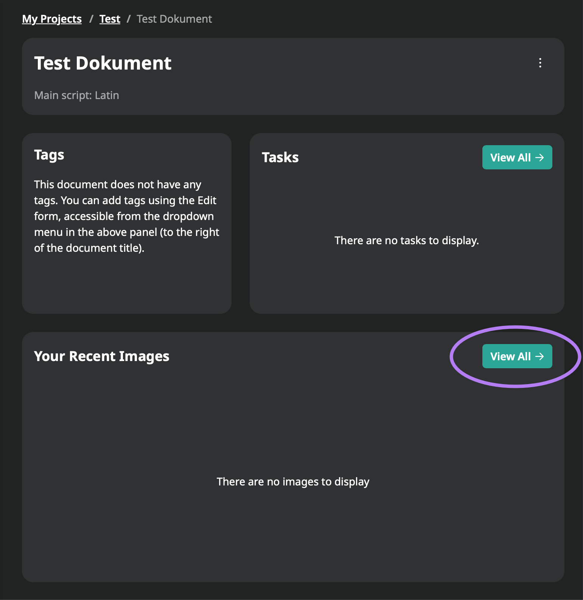

Es gibt mehrere Möglichkeiten, Bilder auf die Plattform hochzuladen, die im Folgenden erläutert werden.

#### 1.4.2. Lokale Dateien importieren
Die Bilder können einfach per „Drag and Drop“ hochgeladen werden oder durch Auswählen der Bilder im File Explorer, mittels eines Klicks in die Box.

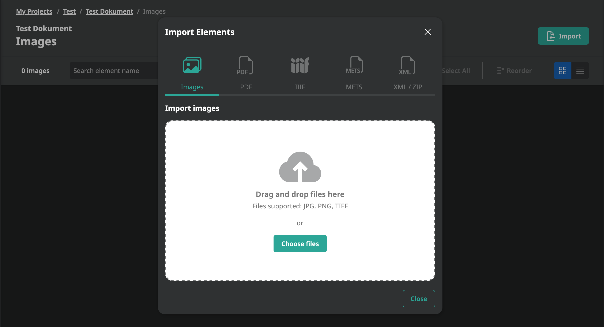

**Hinweis**: Bevor die Seite neugeladen werden kann, muss der Import aller Bilder abgeschlossen sein. eScriptorium bietet momentan keine Möglichkeit Bilder automatisch zu sortieren, daher sollte beim Upload darauf geachtet werden, alle Bilder in der richtigen Reihenfolge auszuwählen sowie auf eine entsprechende Benennung zu achten, ansonsten müssen die Bilder händisch sortiert werden.

#### 1.4.3. Bilder aus einer PDF-Datei importieren
Klicken Sie auf den "Import"-Button und dann auf „PDF“, nun können Sie eine PDF-Datei hochladen. Aus dieser werden automatisch Bilder extrahiert. Bitte beachten Sie, dass ausschließlich Bilder importiert werden. Sollte das PDF eine Textebene enthalten entsprechend der Transkription, wird diese nicht importiert.

#### 1.4.4. Verwendung eines IIIF-Manifests
Klicken Sie auf den „Import“-Button, dann auf die Option „IIIF“ und geben Sie anschließend die URL des IIIF-Manifests ein. Alle Bilder werden lokal kopiert, so wie auch deren Metadaten (falls vorhanden), welche im Tab „Beschreibung“ sichtbar sind. Beispiel-Link: https://gallica.bnf.fr/iiif/ark:/12148/btv1b53026595r/manifest.json

#### 1.4.5 Upload aus einer METS Datei
Klicken Sie auf den "Import"-Button, dann auf die Option "METS" und geben Sie anschließend die URL der METS-Datei ein oder laden Sie eine METS-Datei hoch.

#### 1.4.6 Bilder aus einer XML oder ZIP Datei importieren
Klicken Sie auf den "Import"-Button, dann auf die Option "XML/ZIP" und laden Sie eine XML- oder ZIP-Datei hoch.

Unter "Tasks" wird der Fortschritt des Upload-Prozesses angezeigt.

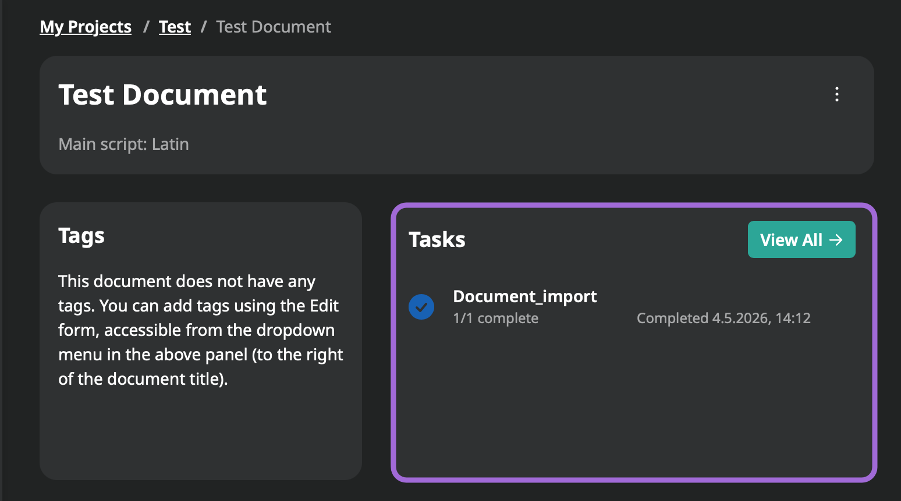

### 1.5. Dokumente manuell mit Annotationen versehen
#### 1.5.1. Zugriff auf das Interface
Manuelle Annotationen sind nötig, um Ground-Truth-Daten zu generieren und damit Modelle zu trainieren oder um Ergebnisse dieser Operationen zu korrigieren. Es kann auch als Teil einer Annotation Campaign (gemeinsames Bearbeiten eines Dokumentes innerhalb einer Gruppe) verwendet werden, die nicht auf Kraken-Modelle zurückgreift (eScriptorium ist nur eine Input-Umgebung).

Um Annotationen manuell zu erstellen und zu modifizieren, klicken Sie innerhalb Ihres Dokuments bei "Your Recent Images" auf "View All". Wählen Sie die "Edit"-Optionen auf den jeweiligen Bildern aus, um mehrere Bearbeitungsbereiche passend zu den möglichen Bearbeitungsoptionen auszuwählen (v.l.n.r.).

 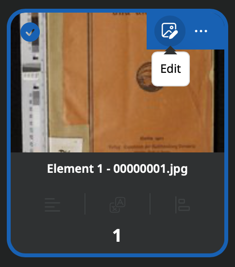
 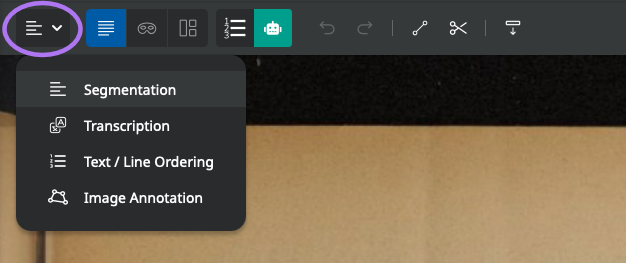

- **„Segment“** zeigt den Segmentationsbearbeitungsbereich an
- **„Transcribe“** zeigt den Bearbeitungsbereich der Transkription in der diplomatischen Ansicht an
- **„Text/Line Ordering“** zeigt den Bearbeitungsbereich der Transkription im Textmodus an, um die Lesereihenfolge zu ändern oder um Transkriptionen zu erstellen
- **„Image Annotation“** zeigt den Bearbeitungsbereich der Bildannotation an

#### 1.5.2. Segmente und Bereiche auf dem Bild mit Annotationen versehen
Im Segmentbearbeitungsfenster können Sie mehrere wesentliche Operationen durchführen:

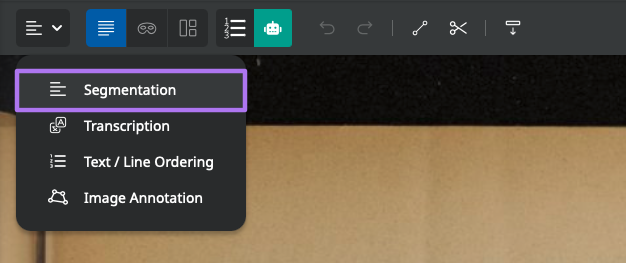

**Baselines:** (Lines mode)
- Das Zeichnen von „Baselines“, die den Positionen des Textes auf dem Bild entsprechen, kann auf **zwei unterschiedliche Arten erfolgen**:
  - **Freies Zeichnen** (nicht empfohlen): linke Maustaste gedrückt halten und gewünschte Zeile ziehen
  - **Punkt-für-Punkt-Darstellung**: Linksklick an die entsprechende Stelle, durch einen Rechtsklick können Punkte hinzugefügt werden und durch einen erneuten Linksklick die Zeile beendet werden
- **Zeilen Verschieben**: Zeilen auswählen und mit STRG + Ziehen an der gewünschten Stelle platzieren
- **Zeilen auswählen**: SHIFT + Klick auf entsprechende Zeilen
- **Auswahl aufheben**: durch das Klicken auf eine leere Stelle, wird die Auswahl aufgehoben
- **Zeilenzeichnen abbrechen**: während die Zeile gezeichnet wird, Escape-Taste drücken
- **Zeilen löschen**: Der Papierkorb löscht alle ausgewählten Zeilen; wenn SHIFT gedrückt gehalten wird, können mehrere Zeilen gleichzeitig gelöscht werden
- **Zeilen verbinden**: Wenn mindestens zwei Zeilen ausgewählt sind, wird eine Option zum Verbinden der Zeilen verfügbar (J-Taste): SHIFT + Auswählen entsprechender Zeilen → SHIFT lösen → STRG + J
- **Kontrollpunkte auf Zeile hinzufügen**: Zeile auswählen und Doppel-Klick auf die entsprechende Stelle
- **Verlängern mehrerer Zeilen**: Falls mehrere Zeilen als zu kurz erkannt wurden, können Sie diese einfach auf eine Länge bringen (meist sinnvoll bei Texten im Blocksatz): Gelbe Schere aktivieren → SHIFT + Markieren aller Anfangs- bzw. Endpunkte der Reihe → Schere deaktivieren → SHIFT + erneut alle Punkte markieren → SHIFT lösen → STRG + alle Zeilen auf gewünschte Länge ziehen
- **Kontrollpunkte auf einer Zeile auswählen oder verändern**: Klicken Sie mit der linken Maustaste auf eine Zeile, um sie auszuwählen, und ziehen Sie dann den ihr am nächsten liegenden Kontrollpunkt. Ein Doppelklick auf die Zeile erzeugt einen neuen Kontrollpunkt an der Mausposition. Sie können die Reihenfolge der Punkte der Zeile umkehren, indem Sie eine Zeile (oder mehrere) auswählen und den Umkehrbutton (Taste I) betätigen.
- **Verschieben einer oder mehrerer Kontrollpunkte**: einfach Kontrollpunkt auswählen und an gewünschte Stelle ziehen
- **Lasso-Auswahlwerkzeug**: Mit SHIFT + Ziehen erzeugen Sie ein Lasso-Auswahlwerkzeug, womit Sie Kontrollpunkte auswählen können (sie erscheinen dann schwarz). **Hinweis**: Wenn bereits Zeilen ausgewählt sind, wählt das Lasso nur Punkte auf diesen Zeilen aus.
- **Mehrere Kontrollpunkte bzw. Zeilen gleichzeitig verschieben**: Mit der Tastenkombination STRG + Ziehen können Sie alle ausgewählten Kontrollpunkte auf einmal verschieben (oder die ausgewählten Zeilen, wenn keine Kontrollpunkte ausgewählt sind).
- **Kontrollpunkte löschen**: der Papierkorb löscht nur ausgewählte Kontrollpunkte; Hinweis: Es sollte eigentlich nur am Anfang und am Ende der Zeilen jeweils ein Punkt sein. Es könnte sein, dass bei einigen Dokumenten ein Problem bei der Transkription auftritt, falls zu viele Punkte vorhanden sind: SHIFT + innerhalb der Anfangs- und Endpunkte der Zeilen alles markieren → gelben Papierkorb anklicken.
- **Scheren-Tool**: Mit dem Ausschneidemodus (Taste C oder dem gelben Scheren-Button) können Sie Zeilen ausschneiden, in zwei Teile teilen oder einen Teil davon entfernen.
- **Leserichtung einer Zeile**: Die Leserichtung kann über den Button „Segment“ im Tab „Images“ festgelegt werden.

**Masken** (Masks mode):
- **Berechnung von Polygonen/Masken**: Aktivierung der Berechnung von Polygonen, die mit jeder Zeile verbunden sind (Vorgang ist automatisiert und wird asynchron verwaltet, ohne dass der Benutzer nach der ersten Verwendung etwas tun muss)
- **Erstellung von neuen Masken**: wenn eine Seite bereits Masken hat, erhalten neue Zeilen automatisch auch eine Maske. Bei der Aktualisierung einer Zeile, werden auch automatisch Masken neu berechnet.
- **Hinweis**: Die Qualität der Masken ist abhängig von der Qualität der Segmentierung und nicht nur der dazugehörigen Zeile. Es sollten alle Zeilen eingezeichnet sein, bevor die Masken kalkuliert werden.

**Textbereiche** (Regions mode):
In diesem Fenster können Bereiche (oder Zonen) erstellt werden und Segmente/Zeilen mit diesen verbunden werden. Ein Segment, das sich innerhalb eines Bereichs befindet, ist daher nicht automatisch mit diesem verbunden.
- **Von Zeilenansicht in Bereichsansicht wechseln**: „R“-Taste auf der Tastatur drücken
- **Bereich erstellen**: In der Segmentierungsansicht können Sie durch einen Linksklick einen neuen Bereich anlegen und durch einen erneuten Linksklick den ausgewählten Bereich anlegen/fertigstellen.
- **Bereiche verändern**: In der Bereichsansicht können Sie durch einen Linksklick einen neuen Bereich anlegen und durch einen erneuten Linksklick den ausgewählten Bereich anlegen/fertigstellen.
- Zeilen, die innerhalb eines Bereichs gezeichnet werden, werden automatisch an diesen gebunden.
- **Zeilen mit Bereichen verbinden bzw. davon trennen**: Ausgewählte Zeilen können mit den entsprechenden Schaltflächen mit Bereichen verknüpft (Y-Taste) oder von ihnen getrennt (U-Taste) werden.
- **Bereiche löschen**: Durch anklicken des Bereichs in der Bereichsansicht und anschließendem anklicken des Papierkorbs, können Bereiche gelöscht werden.

**Zusätzliche Hinweise:**
Sie können jederzeit mit Strg + Z (Rückgängig machen) und Strg + Y (Wiederherstellen) Aktionen rückgängig machen bzw. wiederherstellen oder mit den entsprechenden Schaltflächen durch Ihren Änderungsverlauf gehen.

#### 1.5.3. Annotieren der Transkription
Nur wenn Baselines und Masken auf dem Bild festgelegt sind, gibt es die Möglichkeit, die Funktionalitäten der Buttons „Transcription“ und „Text/Line Ordering“ zu nutzen.
Um eine einer Zeile zugeordnete Transkription hinzuzufügen oder zu ändern, klicken Sie im Bereich "Transcription" auf die entsprechende Zeile. Ein Eingabefenster wird angezeigt. Um eine Transkription aufzunehmen, drücken Sie „Enter“: es wird automatisch das Eingabefeld für die nächste Zeile angezeigt.
Während Sie im Fenster "Transcription" tippen, werden die mit Zeilen versehenen Bereiche durch Text ersetzt und der Inhalt des Fensters "Text" ändert sich. Es ist also möglich den Text im Textfenster zu modifizieren, zu kopieren und mehrere Zeilen auf einmal einzufügen.

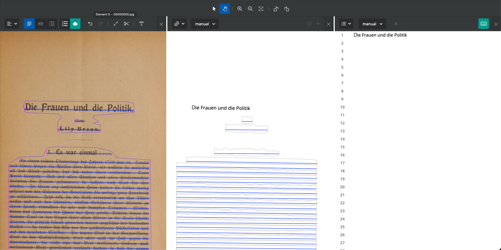

#### 1.5.4. Eine Anmerkung zur Gliederung von Baselines, Polygonen und Transkriptionen
Die „Baseline“ ist ein zentrales Element, um Informationen in der Datenbank von eScriptorium zu speichern. Also:
- Es ist möglich eine Baseline zu modifizieren (bewegen, Punkte hinzufügen) ohne, dass die Transkription beeinflusst wird
- Das Polygon wird immer von der Baseline aus berechnet, auch während des Trainings
- Es ist möglich das Polygon händisch zu ändern (nicht empfohlen), ohne dass dies Auswirkungen auf die Transkription hat

>Bildquelle: https://lectaurep.hypotheses.org/documentation/prendre-en-main-escriptorium

Während des Trainings der Kraken-Modelle, kann die Berechnung der Polygone zurückgesetzt werden: Für den User ist es daher von Vorteil, nicht in die Polygone einzugreifen und im Gegenteil dafür zu sorgen, dass die Baselines so gezeichnet werden, dass die automatisch erzeugten Polygone korrekt sind. Falls manuell Ground-Truth-Daten eingegeben werden, sollte darauf geachtet werden nur zu transkribieren was innerhalb des Polygons steht.

#### 1.5.5. Die Reihenfolge der Zeilen ändern
Die Wiedergabereihenfolge der Zeilen erfolgt automatisch. Sie können sich die Ordnungsnummer jeder Zeile im Fenster „Segmentation“ anzeigen lassen, indem Sie auf “Line numbering (N)” klicken, oder im Fenster „Text/Line Ordering“, wo die Zeilen in der folgenden Reihenfolge angezeigt werden.
Es ist möglich die Reihenfolge im „Text/Line Ordering“-Fenster durch das Klicken von “Line ordering mode” zu ändern. Durch einfaches „Drag and Drop“ der Zeilen kann die Änderung durchgeführt werden.

**Hinweis:** Es ist empfehlenswert, die Qualität der Segmentierung sicherzustellen, bevor die Reihenfolge der Zeilen geändert wird, weil das Hinzufügen und Entfernen von Zeilen die Berechnung dieser Reihenfolge systematisch neustartet und dabei manuelle Modifikationen überschreibt.

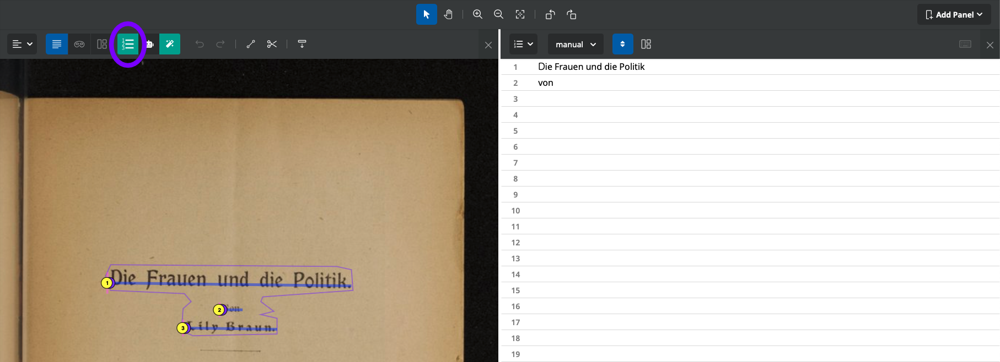

#### 1.5.6. Semantische Annotationen
Es ist möglich, den Zeilen und Bereichen Etiketten (oder Tags) zuzuordnen, indem man einer vom User vordefinierten Ontologie folgt. Es gibt Standard-Tags, aber es ist auch möglich, diese über das Eingabefeld hinzuzufügen (Klicken Sie rechts oben auf das Symbol mit dem Viereck, dem Kreis, dem Dreieck und dem Pluszeichen, dann „Add New“ und anschließend fügen Sie den neuen Tag zur Liste hinzu und bestätigen Sie mit "Save") oder zu löschen (entfernen Sie die Haken von den Boxen vor dem Tag und klicken Sie anschließend auf „Save“).

Wählen Sie im Bereich „Segmentation“ einen Bereich oder eine Zeile aus, klicken Sie auf „Set the type of selected lines (T)” (Das Symbol mit dem Viereck, dem Kreis und dem Dreieck) und wählen Sie das entsprechende Tag aus. Die Farben des Bereichs oder der Zeile ändern sich. Es ist möglich, ein Tag auf mehrere Bereiche oder Zeilen auf einmal anzuwenden: dafür wählen Sie alle gewünschten Bereiche aus (STRG+ Klick und Ziehen oder STRG gedrückt halten und die gewünschten Zeilen/Bereiche anklicken).

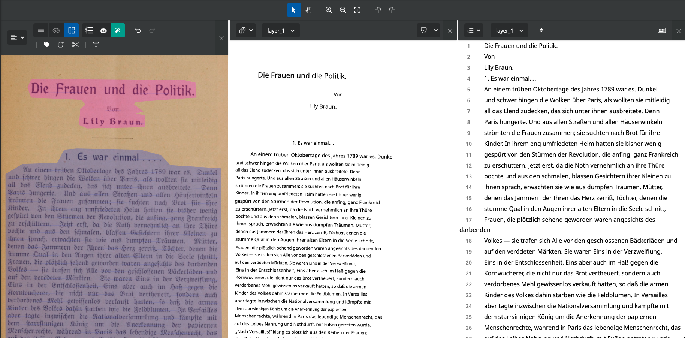

### 1.6. Annotationen Importieren
#### 1.6.1. Strukturierte Annotationen als XML importieren
Es gibt die Möglichkeit Segmentierungen oder Transkriptionen, die außerhalb von eScriptorium erstellt wurden zu importieren. Dafür klicken Sie unter dem Tab „Images“ auf „Import“ und wählen dann die Option „XML/ZIP“ aus.
Nun können Sie einen Namen für die importierte Version festlegen, und eine Datei für den Import hochladen. Dies kann eine ALTO XML Datei, eine PAGE XML Datei oder eine ZIP-Datei, die ALTO oder PAGE Dateien beinhaltet, sein.
Es ist nicht notwendig vorher auszuwählen, welche Teile des Dokuments vom Import betroffen sind: die Verbindung wird automatisch hergestellt durch die Informationen aus den XML Dateien.

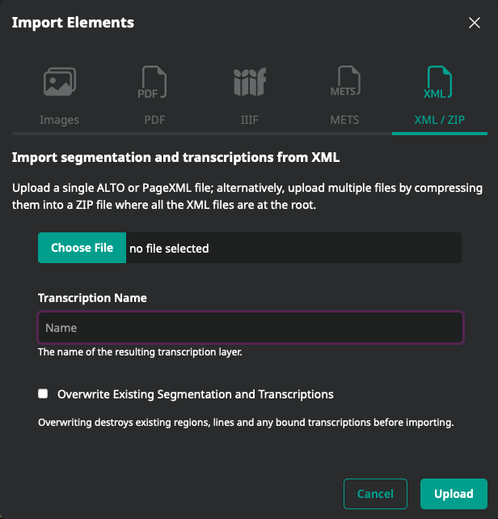

Bitte beachten Sie, dass es, nachdem Segmentierungen importiert wurden, die nicht mit Kraken/eScriptorium erzeugt wurden, wichtig ist, die Polygone (Masken) zurückzusetzen bevor mit diesen Dokumenten Modelle trainiert werden.

#### 1.6.2. Importieren von Annotationen aus einfachem Text
Es ist möglich, im Bearbeitungsmodus (Bei einem Bild auf "Edit" klicken) unter "Text/Line Ordering" manuell eine Transkription von einem einfachen Text zu importieren. Jeder Zeilenumbruch zeigt dann den Übergang zu einem neuen Abschnitt an. Es ist daher darauf zu achten, dass die Lesereihenfolge der Zeilen übereinstimmt.

### 1.7. Dokumente automatisch mit Annotationen versehen
#### 1.7.1. Anleitung
Automatische Dokumentannotationen werden über den Tab „Images“ verwaltet.
- Wählen Sie die Bilder aus, die Sie mit Annotationen versehen wollen
- Klicken Sie auf „Segment“ (für die Erkennung von Baselines, Polygonen und/oder Bereichen) oder auf „Transcribe“ (für Transkriptionen)
- Ein Formular wird angezeigt: Es erlaubt Ihnen, ein Kraken-Modell hochzuladen oder ein Modell zu nutzen, das schon in eScriptorium existiert, und anschließend die Segmentierung bzw. Annotation zu konfigurieren

#### 1.7.2. Einrichten der Segmentierung
- **„Include“** erlaubt es Ihnen, festzulegen, auf welcher Ebene die Segmentierung durchgeführt werden soll
- Die Auswahl von **„Lines“** und **„Regions“** erzeugt Bereiche (sofern das verwendete Modell dafür trainiert wurde), Baselines und zugehörige Polygone
- **„Lines“** führt zur Erzeugung von Baselines und den damit verbundenen Polygonen
- **„Regions“** ermöglichen es, Baselines und Polygone, die schon auf den Bildern existieren, zu erhalten und nur neue Bereiche zu generieren
- **„Text Direction“** indiziert die Leserichtung der Zeilen

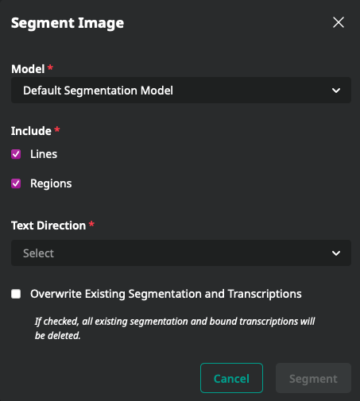

#### 1.7.3. Vergleich verschiedener Transkriptionen
- Laden Sie das Bild eines Dokumentes in eScriptorium hoch
- Führen Sie die Texterkennung mit dem gewünschten Modell durch und anschließend mit einem zweiten Modell oder mit manueller Texterkennung
- Nun wählen Sie in der Bearbeitungsansicht eine Textzeile in der Transkription aus, die angezeigt werden soll
- Anschließend klicken Sie auf “Transcription comparison” und wählen im drop-down menu die Transkriptionen aus, die Sie vergleichen möchten
- Sie sehen nun markierten Text in rot und grün: Grüne Zeichen sind in der aktuellen (bearbeitbaren) Transkription nicht vorhanden, rote Zeichen sind in der verglichenen Transkription nicht vorhanden

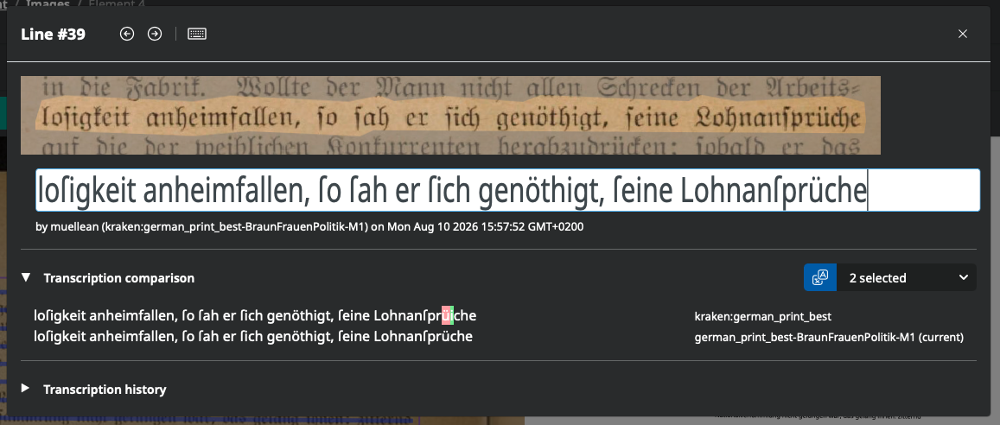

### 1.8. Modelle trainieren
#### 1.8.1. Ein Training starten
Das Training von Kraken-Modellen startet man innerhalb des Tabs „Bilder“. Es wird über den Tab „Modelle“ verfolgt (inaktiv solange noch kein anderes Modell als das Standardmodell mit dem Dokument verknüpft ist).
Der Zugang zu den Trainingsfunktionen hängt von der Autorisierung ab. Dies kann über die Administrationsschnittstelle verwaltet werden.
Um ein Modell zu trainieren müssen sich alle Bilder/Annotationen im gleichen Dokument befinden.
- Wählen Sie die Bilder aus, die die Ground-Truth-Daten enthalten
- Gehen Sie auf „Train Model“ und wählen Sie die Art des Trainingsmodells aus: „Segmenter“ für ein Segmentierungsmodell, „Recognizer“ für ein Transkriptionsmodell
- Füllen Sie das Formular aus und klicken Sie anschließend auf „Train“
- Das Training wird gestartet, manchmal müssen Sie einen Augenblick warten bis dies angezeigt wird
- Wenn das Training beendet ist, erhalten Sie eine Benachrichtigung und können das finale Modell im Tab „Modelle“ finden. Es ist nun möglich das Modell zu downloaden oder es auf einem Dokument anzuwenden.

#### 1.8.2. Ein Modell verfeinern oder von Grund auf neu trainieren?
Das Formular für die Trainingskonfiguration ermöglicht Ihnen folgende Auswahl:
- **ob Sie von Grund auf neu beginnen möchten** (geben Sie hierfür einfach einen Namen für das zu erstellende Modell an)
- **oder ob Sie ein Modell verfeinern möchten** (es kann über den File Manager hochgeladen werden oder sich schon in der Modellliste des zugehörigen Dokuments befinden)
**Achtung:** In Version 0.6.9 ist das Bearbeiten der Namen von Modellen nur möglich, wenn man ein ganz neues Modell trainiert. Um zu vermeiden, dass ein bereits existierendes Modell überschrieben wird, sollten Sie das Modell lokal auf Ihrem Rechner downloaden und in den gewünschten Namen umbenennen, dann können Sie es über das Formular erneut in eScriptorium hochladen.

### 1.9. Annotationen exportieren
Das Exportieren von Annotationen funktioniert über den Tab „Images“.
- Wählen Sie die relevanten Bilder aus
- Klicken Sie auf „Export“, dann füllen Sie das Formular aus:
  - Spezifizieren Sie die **Version der Transkription (Transcription)**, die Sie exportieren möchten
  - Spezifizieren Sie das **Export-Format (File Format)**: „ALTO“ für XML ALTO, „PageXML“ für XML PAGE oder „Text“ für einfachen Text
  - Setzen Sie einen Haken bei „Include Images“, wenn Sie zusätzlich die **Bilder exportieren** möchten
  - Klicken Sie auf „Export“ und speichern Sie die **generierte ZIP-Datei**

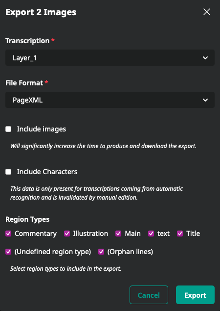

## 2. Verwalten einer kollaborativen Annotation Campaign
### 2.1. Erstellen einer Usergruppe (Admin)
Es ist möglich, eine Nutzergruppe zu erstellen (vorausgesetzt, Sie haben die erforderlichen Rechte). Diese Gruppen dienen dazu, Arbeitsgruppen zu definieren oder ausgewählten Usern bestimmte Rechte zu erteilen.
Klicken Sie hierfür innerhalb eines Projekts rechts oben auf "Groups & Users"; hier können Gruppen erstellt werden. Zudem werden hier auch die eigenen Gruppenzugehörigkeiten aufgelistet.

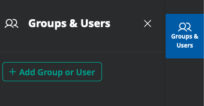

### 2.2. Teilen eines Dokumentes mit einem anderen User oder einer Gruppe
Ein User kann ein Dokument mit mehreren anderen Usern teilen, auch mit denjenigen, die nicht Teil der Gruppe sind, der das Dokument angehört. Dies ist innerhalb eines Dokuments über den Button "Groups & Users" und über den Tab „Beschreibung“ möglich:
- Geben Sie den Namen des Users ein, mit dem Sie Ihr Dokument teilen möchten oder setzen Sie einen Haken bei seinem Namen in der Liste
- Um zu bestätigen, klicken Sie auf „Submit“

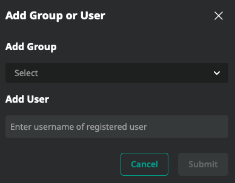

### 2.3. Ein Modell mit einem anderen User oder einer Gruppe teilen
Ein Modell ist mit einem Dokument verknüpft und nicht mit einem User. Um ein Modell mit anderen Usern zu teilen, gibt es zwei Möglichkeiten:
- Downloaden Sie das Modell im Tab „Modelle“ und versenden Sie es über einen anderen Kanal (z.B. per E-Mail)
- Teilen Sie mit dem User das Dokument, dem das Modell zugeordnet ist. Nun kann der andere User es herunterladen und es in das Dokument laden, in dem er es anwenden möchte.

## 3. Sonstiges
- **Wichtig**: Zeilen, Bereiche und Masken immer bearbeiten, bevor transkribiert wurde, da diese sonst an dieser Stelle gelöscht werden können.
- **Binarisierung**: Dies ist meist nicht nötig, nach dem Hochladen der Bilder können diese i.d.R. direkt segmentiert werden. In den meisten Fällen verschlechtert die Binarisierung das Ergebnis.
- **Keine Reaktion mehr bei der Bearbeitung des Dokuments**: Seite erneut laden (tauchte bei Firefox bisher öfters auf, ist aber noch unklar wann genau es vorkommt und woran es liegt)
- **Kein Warten im Fenster auf Segmentierung, Binarisierung und Transkription**: Während dieser Prozesse, die mitunter länger dauern können, kann das Fenster verlassen werden. Der Prozess wird nicht abgebrochen.
- **Kein Speichern nötig**: Alle Vorgänge werden automatisch gespeichert. Wird das Bearbeitungsfenster einmal verlassen, kann man Aktionen nicht mehr rückgängig machen.
- Sollte es Probleme mit der Internetverbindung geben, kann dies zum Verlust von Arbeitsschritten führen.

## 4. Zusätzliche Funktionen der Mannheim-Instanz
Neben den Standardfunktionen bietet die von der Universitätsbibliothek Mannheim betriebene Instanz einige zusätzliche Funktionen, die in den vorangehenden Abschnitten nicht beschrieben sind:
- [Zeilenbasislinien in der Transkriptionsansicht bearbeiten](#41-zeilenbasislinien-in-der-transkriptionsansicht-bearbeiten)
- [Schriftart für die Transkription wählen](#42-schriftart-für-die-transkription-wählen)
- [Anzeigesprache wechseln](#43-anzeigesprache-wechseln)

### 4.1. Zeilenbasislinien in der Transkriptionsansicht bearbeiten
Neben der Segmentierungsansicht (siehe Abschnitt 1.5.2) können die Baselines einer Zeile auch direkt im Eingabefenster der Transkription korrigiert werden. Öffnen Sie dafür im Bearbeitungsbereich „Transcribe“ eine Zeile. In der Kopfzeile des Fensters befindet sich rechts neben dem Button für die virtuelle Tastatur ein Button mit einem Bleistift-Symbol:

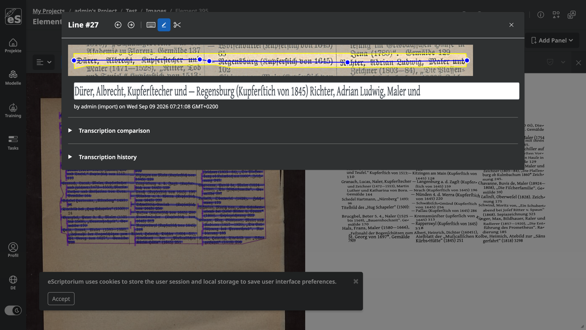

- **Basislinienbearbeitung aktivieren:** Der Bleistift-Button blendet die Maske (gelbes Polygon) und die Baseline (blaue Linie) der Zeile auf der Vorschau ein. Die einzelnen Punkte der Baseline werden als blaue Kreise dargestellt und können per **Drag and Drop** an die gewünschte Stelle gezogen werden. Die Anpassung wird live angezeigt; beim Loslassen wird die Zeile gespeichert und die Maske wird automatisch neu berechnet.
- **Basislinie ausschneiden oder teilen:** Ist die Basislinienbearbeitung aktiviert, kann über den Button mit dem Scheren-Symbol zusätzlich der **Ausschneidemodus** für die Baseline eingeschaltet werden. Die Punkte werden dabei ausgeblendet; mit einer rechteckigen Auswahl, die per Ziehen direkt auf der Baseline gezogen wird, kann ein Teilstück entfernt werden. Zieht die Auswahl über einen mittleren Abschnitt, wird die Baseline an dieser Stelle durchtrennt (die Zeile wird geteilt); zieht sie über ein Ende, wird dieses abgeschnitten.

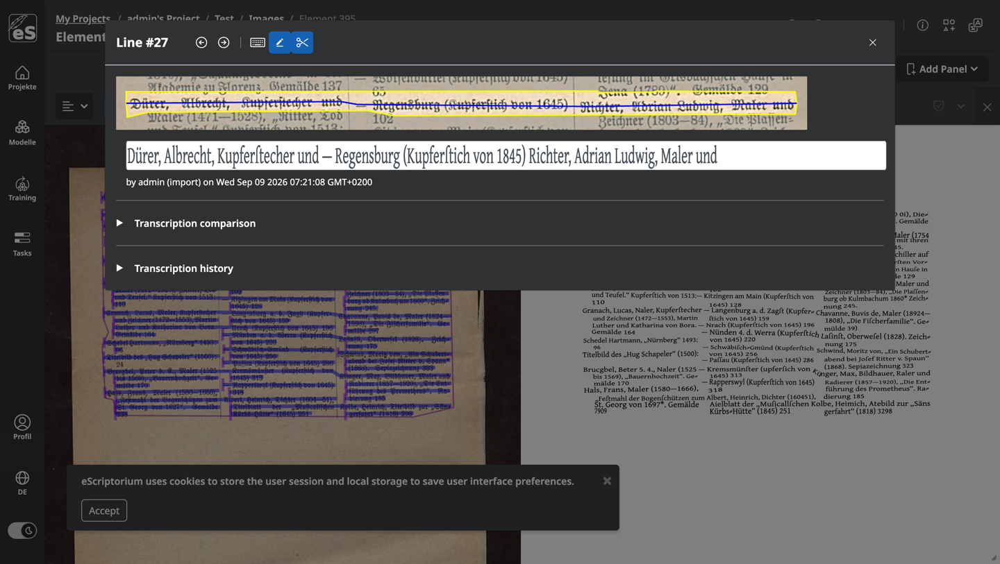

Dieses Verfahren eignet sich gut für gezielte Korrekturen einzelner Zeilen, während größere Eingriffe (viele Zeilen, neue Baselines) weiterhin in der Segmentierungsansicht erfolgen.

### 4.2. Schriftart für die Transkription wählen
Über das Menü rechts neben dem Dokumenttitel (Symbol mit dem Bleistift) und die Option „Bearbeiten“ öffnen Sie das Dokumentformular. Neben den üblichen Feldern (Name, Sprache, Leserichtung, Position der Zeilen) gibt es dort das Feld **„Transkriptionsschriftart“**:

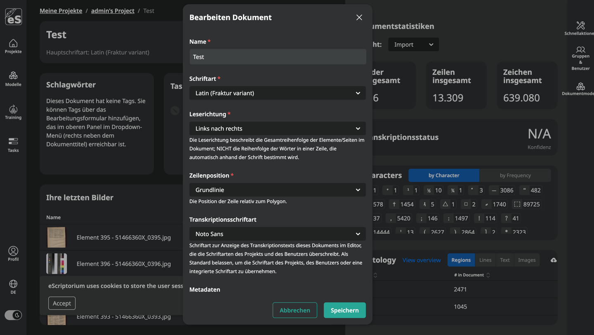

- Hier wählen Sie aus, in welcher Schrift die Transkriptionszeilen im Bearbeitungsfenster angezeigt werden. Die Auswahl „Standard“ bedeutet, dass die Schrift des Projekts bzw. des Benutzerkontos bzw. die eingebaute Standardschrift (Noto Sans) verwendet wird.
- Verfügbare Schriftarten richtet der Administrator der Instanz ein (siehe [Administration](./administration.md#1-transkriptionsschriftarten-einrichten)); die Instanz der UB Mannheim stellt unter anderem *Gentium Plus*, *Noto Sans*, *Noto Sans Hebrew*, *OpenDyslexic* und *Abyssinica* (für äthiopische Schriften) bereit.
- Dieselbe Einstellung existiert auch auf Projektebene (Projekt bearbeiten) und pro Benutzer, sodass Dokumente eine projektspezifische oder persönliche Schrift verwenden können, ohne sie an jedem Dokument neu zu wählen.

### 4.3. Anzeigesprache wechseln
Die Benutzeroberfläche von eScriptorium kann in mehreren Sprachen angezeigt werden. In der globalen Navigation (oben rechts) befindet sich ein Button mit einem Globus-Symbol und dem Code der aktuellen Sprache (z. B. „DE“). Ein Klick öffnet die Liste der verfügbaren Sprachen:

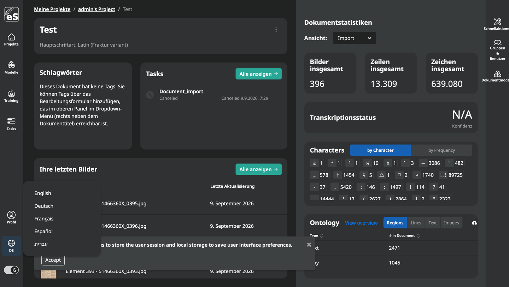

Nach der Auswahl wird die Oberfläche in der gewählten Sprache neu geladen. Welche Sprachen zur Auswahl stehen, richtet der Administrator der Instanz ein; die Instanz der UB Mannheim bietet Deutsch, Englisch, Französisch, Spanisch und Hebräisch.
