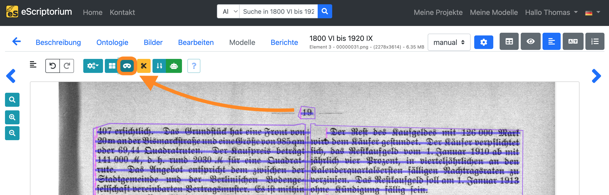
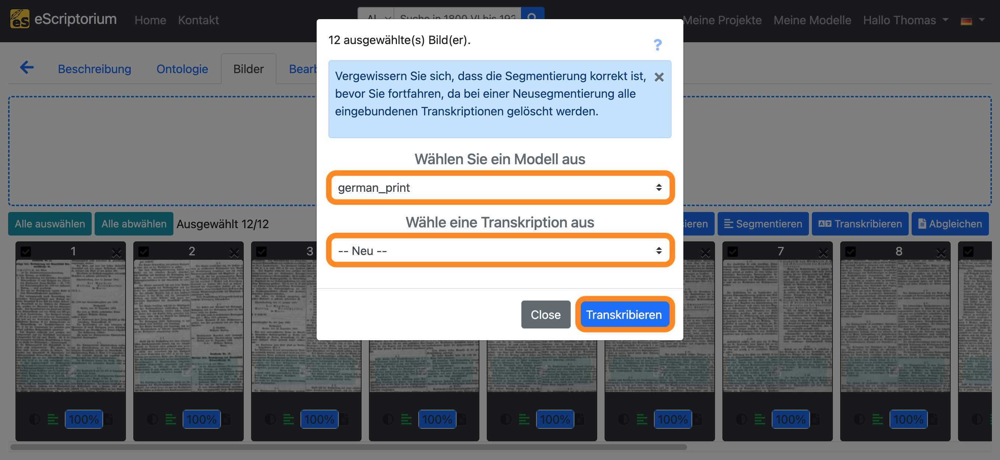
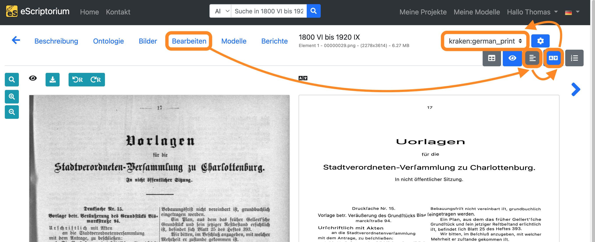
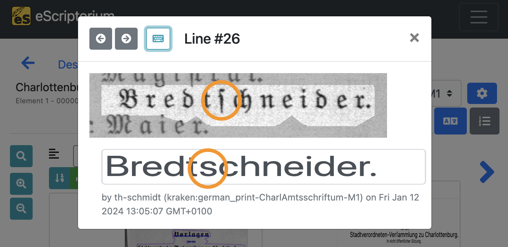
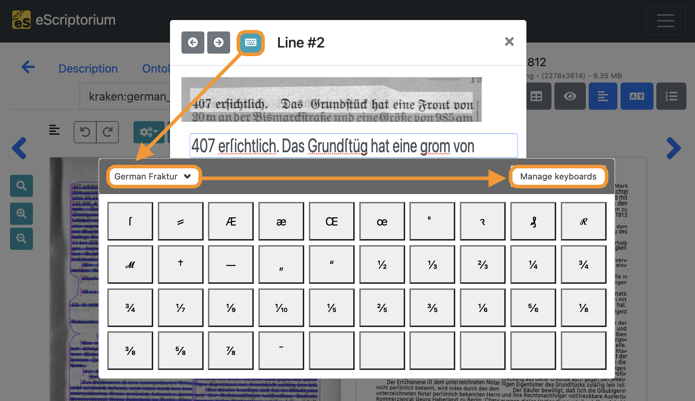
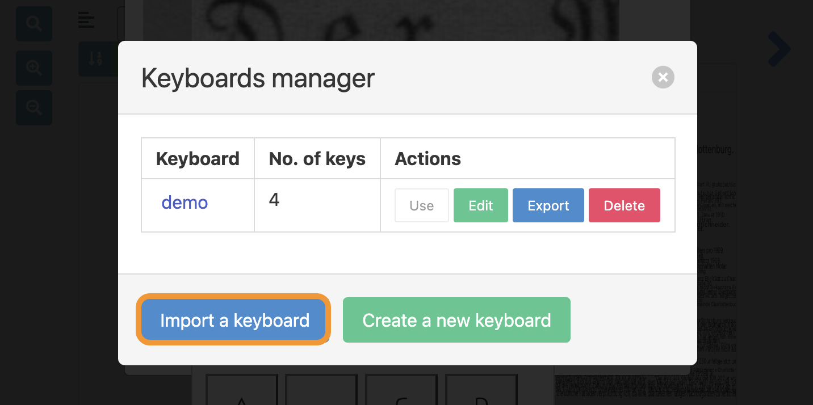
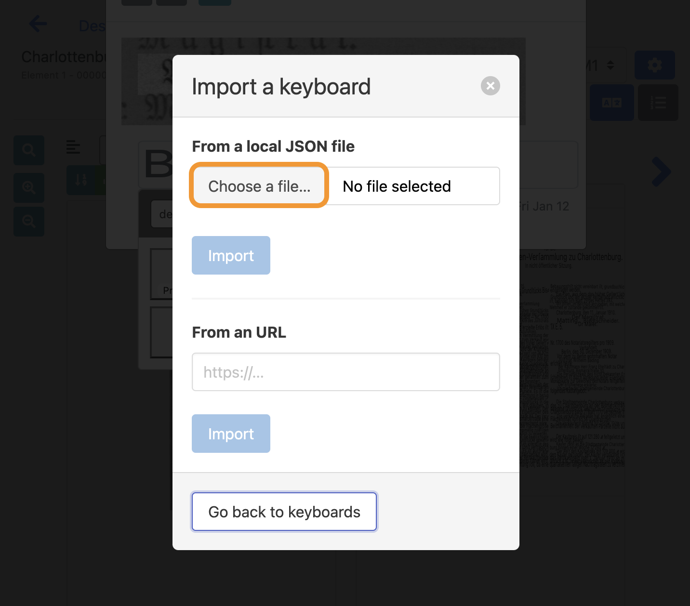
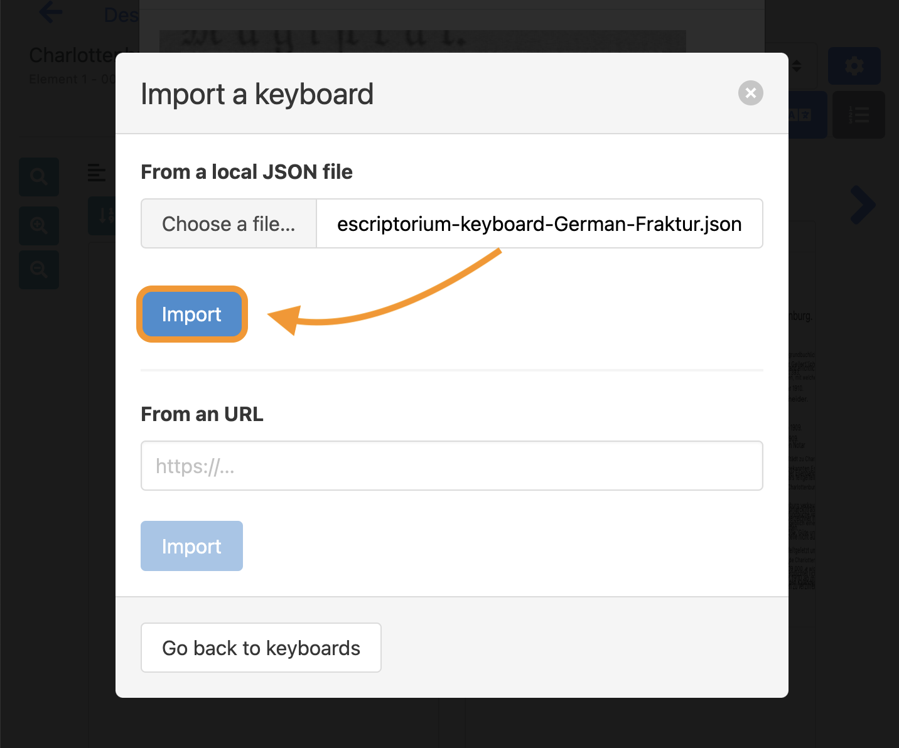
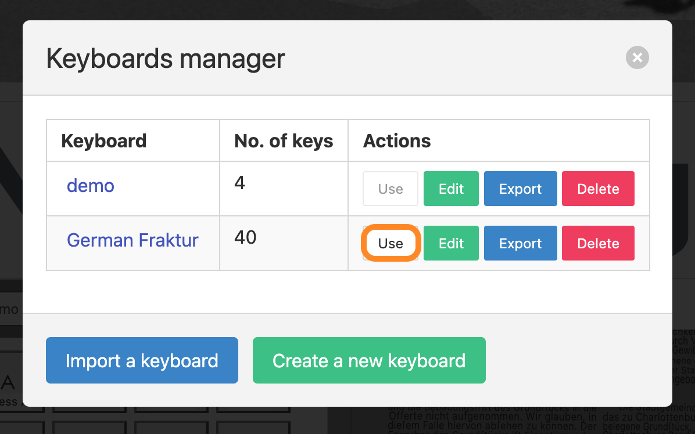

# Training mit eScriptorium (*eine Schritt-für-Schritt-Anleitung*)
**version 1.0 | Februar 2024**

"eScriptorium ist eine Plattform zur manuellen oder automatisierten Segmentierung und Texterkennung von historischen Handschriften und Drucken" [[Wikipedia](https://de.wikipedia.org/wiki/EScriptorium)]. Darüber hinaus ermöglicht die Plattform das benutzerfreundliche Training und das (werkspezifische) Nachtraining eigener Layoutsegmentierungs- und Texterkennungsmodelle direkt im Browser. eScriptorium ist open source und kostenlos. Die trainierten Modelle können ohne Einschränkungen heruntergeladen und verwendet werden.

Die folgende Schritt-für-Schritt-Anleitung gibt eine Einführung in die Nutzung von eScriptorium zum Training eigener OCR- oder HTR-Modelle.

# Inhalt

0. [Für wen ist dieser Guide gedacht?](#0-für-wen-ist-dieser-guide-gedacht) 
1. [Wie funktioniert das Modelltraining?](#1-wie-funktioniert-das-modelltraining) 
2. [Wie funktioniert das Training in eScriptorium?](#2-wie-funktioniert-das-training-in-escriptorium) 
2.1. [Trainingsdaten (Ground Truth) bereitstellen oder erstellen](#21-trainingsdaten-ground-truth-bereitstellen-oder-erstellen) 
2.2. [Wo finde ich Modelle?](#22-wo-finde-ich-modelle) 
2.3. [Wie wähle ich ein Modell für einen bestimmten Nutzungszweck aus?](#23-wie-wähle-ich-ein-modell-für-einen-bestimmten-nutzungszweck-aus)  
3. [Nachtraining / Finetuning in eScriptorium](#3-nachtraining--finetuning-in-escriptorium)  
3.1. [Finetuning eines Texterkennungsmodells](#31-finetuning-eines-texterkennungsmodells) 
3.2. [Finetuning eines Layoutsegmentierungsmodells](#32-finetuning-eines-layoutsegmentierungsmodells) 
4. [Training from scratch in eScriptorium](#4-training-from-scratch-in-escriptorium) 
5. [Weitere Tipps](#5-weitere-tipps) 
5.1. [Das virtuelle Keyboard in eScriptorium verwenden](#51-das-virtuelle-keyboard-in-escriptorium-verwenden)  
5.2. [Ground Truth Empfehlungen für Transkriptionen](#52-ground-truth-empfehlungen-für-transkriptionen) 
6. [Lizenz](#6-lizenz)

## 0. Für wen ist dieser Guide gedacht?
Dieser Leitfaden richtet sich an *fortgeschrittene* eScriptorium-Benutzer*innen mit einem grundlegenden Verständnis der grafischen Oberfläche und Funktionalität der Plattform. Hier sind einige Ressourcen, die Ihnen den Einstieg erleichtern:
- [eScriptorium Quick Start Guide](https://escriptorium.readthedocs.io/en/latest/quick-start/)
- Ein **Videotutorial**, das die wichtigsten Funktionen und Werkzeuge vorstellt, finden Sie auf YouTube: [youtube.com/watch?v=aQuwh3OaKqg](https://www.youtube.com/watch?v=aQuwh3OaKqg) 

Obwohl versucht wurde, den Leitfaden so zugänglich wie möglich zu halten, ließen sich bestimmte Fachbegriffe nicht vermeiden. Wo diese im Leitfaden vorkommen, versuchen wir, sie so klar wie möglich zu erklären. 

Dieser Guide wurde im Rahmen der 3. [OCR-D](https://ocr-d.de/) Förderphase im Modulprojekt [*Workflow für werk­spezifisches Training auf Basis generischer Modelle mit OCR-D sowie Ground-Truth-Aufwertung*](https://www.bib.uni-mannheim.de/ihre-ub/projekte-der-ub/ocr-d-modelltraining/) (2021-2023) an der [Universitätsbibliothek Mannheim](https://www.bib.uni-mannheim.de/) erstellt. Das Modulprojekt wurde von der Deutschen Forschungsgemeinschaft (DFG) gefördert.

**Wir freuen uns über Feedback!**
- [Jan Kamlah](https://orcid.org/0000-0002-0417-7562): `jan.kamlah[at]uni-mannheim[dot]de`
- [Thomas Schmidt](https://orcid.org/0000-0003-3620-3355): `thomas.schmidt[at]uni-mannheim[dot]de`

## 1. Wie funktioniert das Modelltraining?
Für alle automatisierten Layoutsegmentierungs- und Texterkennungsaufgaben verwendet eScriptorium die Open-Source OCR/HTR-Engine [kraken](https://kraken.re/main/index.html). Die für die Layoutsegmentierung und Texterkennung verwendeten Modelle können mit wenigen Klicks direkt in eScriptorium (nach-)trainiert werden. Es können sowohl komplett neue Modelle trainiert werden (`training from scratch`) als auch bestehende Modelle für bestimmte Anwendungsfälle oder Domänen nachtrainiert werden (`Nachtraining` bzw. `Finetuning`). Das Training von OCR-Modellen wird oft über die Kommandozeile durchgeführt und erfordert entsprechende IT-Kenntnisse. Da eScriptorium eine grafische Benutzeroberfläche bietet, können auch Benutzer*innen ohne Kommandozeilen-Kenntnisse Trainings durchführen. 

Allerdings ist es notwendig, den Anwendungsbereich der beiden genannten Trainingsvarianten zu verstehen:

- **`Training from scratch`**: Das Training eines völlig neuen Modells (das nicht auf einem bereits existierenden Modell basiert) wird als *Training from scratch* bezeichnet. Für das Training wird  so genannte *Ground Truth* verwendet, z. B. Digitalisate von Buchseiten mit zugehörigen Transkriptionen, die den Textinhalt der Seiten erfassen. Um robuste OCR-Modelle mit einem Training from scratch zu trainieren, ist in der Regel eine große Menge an Ground Truth erforderlich (manchmal mehrere hunderttausend Textzeilen). Eine solche Datenmenge kann bei eScriptorium zu Problemen führen. Beispielsweise kann ein eScriptorium-Dokument, das für ein Training from scratch mit mehreren tausend digitalisierten Dokumenten und Transkriptionen verwendet werden soll, an Speicher- und Usabilitygrenzen stoßen. In solchen Fällen empfiehlt sich ein [Training außerhalb von eScriptorium über die Kommandozeile](https://kraken.re/main/ketos.html). 
- **`Nachtraining` bzw. `Finetuning`**: Beim (werksspezifischen) Finetuning oder Nachtraining wird ein bestehendes Modell an einen neuen Anwendungsfall oder eine neue Domäne angepasst (*werksspezifisch* bedeutet in diesem Zusammenhang, dass das Finetuning mit Blick auf ein bestimmtes Werk (z. B. ein historisches Dokument, Manuskript oder Buch) oder eine Gruppe ähnlicher Werke vorgenommen wird). Ein einfaches OCR-Modell, das für die Erkennung alphanumerischer lateinischer Standardzeichen trainiert wurde, ist beispielsweise nicht immer in der Lage, Währungssymbole wie den Euro (€), das Pfund (£) oder den Yen (¥) zu erkennen. Um derartige Sonderzeichen zu erkennen, wird ein Nachtraining mit einem Datensatz durchgeführt, der diese speziellen Währungssymbole enthält. Dabei werden die Parameter des Modells so angepasst, dass es diese neuen Symbole besser erkennen und interpretieren kann.

## 2. Wie funktioniert das Training in eScriptorium?
### 2.1. Trainingsdaten (Ground Truth) bereitstellen oder erstellen
Um ein Modell `from scratch` zu trainieren oder ein bestehendes Modell `nachzutrainieren`, werden  Trainingsdaten (*Ground Truth*) benötigt. In eScriptorium werden diese Trainingsdaten innerhalb eines Dokuments bereitgestellt. Die Trainingsdaten bestehen aus **Bildern** (digitalisierte Seiten von Büchern, Manuskripten, Dokumenten usw.) und entsprechenden **Transkriptionen** und **Layoutsegmentierungen**.

#### Ground Truth für Texterkennungsmodelle

Wie der Name sagt, werden Texterkennungsmodelle verwendet, um den Textinhalt eines Bildes automatisch zu erkennen. Wenn Sie ein Texterkennungsmodell trainieren oder finetunen möchten, benötigen Sie **Bilder** und **Transkriptionen**. Hier ist ein Beispiel in eScriptorium mit dem Digitalisat einer Buchseite (links) und der entsprechenden Transkription (rechts):

 

Die Transkriptionen versuchen, den Textinhalt der Bilder so genau wie möglich zu erfassen. Wenn Sie keine existierende Ground Truth haben, mit der Sie trainieren können, können Sie diese direkt in eScriptorium erstellen.

#### Ground Truth für Layoutsegmentierungsmodelle

Layoutsegmentierungsmodelle werden zur automatischen Erkennung aller Textbereiche und Textzeilen auf einem Bild verwendet und sind eine Vorstufe zur eigentlichen Texterkennung. Wenn Sie ein Layoutsegmentierungsmodell trainieren oder finetunen wollen, benötigen Sie **Bilder** und **Layoutsegmentierungsdaten**. Hier ist ein Beispiel in eScriptorium mit dem Digitalisat einer Buchseite (links) und der entsprechenden Layoutsegmentierung (rechts):

 

> **Hinweis:** Die Kapitel [Finetuning eines Texterkennungsmodells](#31-finetuning-eines-texterkennungsmodells) und [Finetuning eines Layoutsegmentierungsmodells](#32-finetuning-eines-layoutsegmentierungsmodells) bieten eine detaillierte Einführung in die Erstellung von Ground Truth für das Training von Texterkennungs- und Layoutsegmentierungsmodellen.

### 2.2. Wo finde ich Modelle?
Vor allem für das Nachtraining bereits vorhandener Layoutsegmentierungs- oder Texterkennungsmodelle werden Basismodelle benötigt. Hier ist eine Liste von Orten, an denen `kraken`-Modelle (die OCR/HTR-Engine, die eScriptorium im Hintergrund verwendet) gefunden werden können:

- **Zenodo**: [zenodo.org/communities/ocr_models](https://zenodo.org/communities/ocr_models)
- **GitHub**: [github.com](https://github.com/)

Alle `kraken`-Modelle können in eScriptorium hochgeladen werden, indem Sie auf **"Meine Modelle"** in der oberen rechten Ecke des Bildschirms klicken. Klicken Sie auf der nächsten Seite auf **"Modell hochladen"** und wählen Sie das Modell aus, das Sie hochladen möchten.

### 2.3. Wie wähle ich ein Modell für einen bestimmten Nutzungszweck aus?
Die Genauigkeit eines Modells hängt von verschiedenen Faktoren ab und muss für jeden Anwendungsfall getestet werden. Ein Modell, das bspw. auf traditionelle chinesische Schriftzeichen trainiert wurde, wird aller Voraussicht nach bei deutschen Dokumenten, die in Fraktur gedruckt sind, nicht gut abschneiden.

Hier sind einige Orientierungspunkte, die bei der Beurteilung eines Modells helfen können:
- Wurde das Modell für **gedruckte** oder **handschriftliche** Dokumente trainiert?
- Welche **Sprachen** (z.B. Englisch, Deutsch, Hebräisch ...) und **Schriftsysteme** (z.B. Latein, Arabisch, Chinesisch ...) deckt das Modell ab?
- Welchen **historischen Zeitraum** und welche **historischen Schriften** deckt das Modell ab? (d.h. ist das Modell z. B. geeignet, Frakturschriften zu erkennen?)

> **Hinweis:** Als Faustregel gilt, dass Sie zunächst **generische Modelle** für Ihren Anwendungsfall testen sollten. *Generische Modelle* werden in der Regel auf einer Vielzahl von Daten (verschiedene Dokumente, Schriftarten usw.) einer bestimmten Domäne (z. B. gedruckte Dokumente in französischer Sprache des 18. Jahrhunderts) trainiert. Häufig bietet der Name eines Modells einen Anhaltspunkt für die trainierte Domäne: `german_newspapers.mlmodel` steht beispielsweise für ein Modell, das mit deutschsprachiger Zeitungs-Ground-Truth trainiert worden ist. Weitere Details und Metadaten, die der Bewertung dienen, können häufig der Modellbeschreibung entnommen werden.

## 3. Nachtraining / Finetuning in eScriptorium
In vielen Fällen kann das Nachtraining eine zeit- und ressourceneffiziente Methode sein, um ein bestehendes Layoutsegmentierungs- oder Texterkennungsmodell auf einen neuen Anwendungsfall anzupassen. Für die Durchführung eines Finetunings wird ein bestehendes Modell benötigt, das während des Nachtrainings an den neuen Anwendungsfall angepasst wird. 

Für das Finetuning eines Modells in eScriptorium empfehlen wir folgenden Workflow:

1. Upload der Bilder, die für das Training verwendet werden sollen
2. Test der automatischen Layoutsegmentierung und Texterkennung für die hochgeladenen Bilder mit anschließender Evaluation des Ergebnisses
3. Verbesserung von Layoutsegmentierung und Transkriptionen, die in Schritt 2 automatisch generiert wurden
4. Finetuning des in "Schritt 2" verwendeten Modells mit den in "Schritt 3" erstellten Trainingsdaten (*Ground Truth*)
5. Evaluierung der Ergebnisse und (falls erforderlich) Wiederholung von Schritt 3 und 4

Die folgenden Abschnitte beschreiben diesen Workflow im Detail.

### 3.1. Finetuning eines Texterkennungsmodells
#### Schritt 1: Neues Projekt und Dokument erstellen
Beginnen Sie mit dem Anlegen eines neuen eScriptorium-Projekts, indem Sie zur eScriptorium-Startseite gehen und auf **"Meine Projekte"** in der oberen rechten Ecke des Bildschirms klicken.

Klicken Sie anschließend auf die grüne Schaltfläche **"Erzeuge neues Projekt"**.

Geben Sie Ihrem Projekt auf der nächsten Seite einen Namen und klicken Sie auf **"Erzeugen"**.

Nachdem das Projekt erstellt wurde, wird die Projektübersicht angezeigt. Hier sollte das Projekt, das Sie gerade angelegt haben, angezeigt werden. Klicken Sie auf den entsprechenden Link.

Erstellen Sie ein neues Dokument in Ihrem Projekt, indem Sie auf die grüne Schaltfläche **"Neues Dokument anlegen"** klicken.

Geben Sie auf der nächsten Seite einen Namen für das Dokument ein und klicken Sie auf **"Erzeugen"** (bzw. **"Aktualisieren"**). In der oberen rechten Ecke sollte eine Meldung erscheinen, dass das Dokument erfolgreich erstellt worden ist.

#### Schritt 2: Bilder importieren

Wechseln Sie zum Reiter **"Bilder"** und laden Sie Ihre Bilder hoch, indem Sie entweder in den Bereich **"Bilder hier ablegen oder zum Hochladen anklicken"** oder auf die Schaltfläche **"Import"** klicken.

Hier sind die Unterschiede zwischen den beiden Optionen:
- **"Bilder hier ablegen oder zum Hochladen anklicken"**: Lädt Bilder von Ihrer Festplatte in verschiedenen Dateiformaten hoch (`PNG`, `JPG`, `TIFF` usw.)
- Schaltfläche **"Import"**: Importieren von Bildern über das `IIIF`-Protokoll oder Upload von `PDF`-Dokumenten.

Sobald alle Bilder hochgeladen wurden, erscheinen sie als Vorschau am unteren Rand des Bildschirms.

#### Schritt 3: Automatische Layoutsegmentierung durchführen

> **Anmerkung 1:** Schritt 3 umfasst die automatische Layoutsegmentierung. Ziel ist es, ein Modell zu finden, das für die hochgeladenen Bilder bereits gut funktioniert, um dieses Modell anschließend im Nachtraining zu verbessern (und es für die verfügbaren Daten noch leistungsfähiger zu machen). Wenn Sie nach Layoutsegmentierungsmodellen suchen, ist Kapitel [2.2 Wo finde ich Modelle?](#22-wo-finde-ich-modelle) hilfreich.
> **Anmerkung 2:** Wir empfehlen, entweder mit *RGB*- oder *Graustufen*-Bildern zu arbeiten, da die Binarisierung zu einem Verlust an Bilddetails führen kann. Deshalb verzichten wir in den folgenden Schritten auf die **Binarisieren**-Funktion von eScriptorium.

Wählen Sie alle Bilder aus, indem Sie auf die Schaltfläche **"Alles auswählen"** klicken. Alle Bilder im aktuellen Dokument sollten nun hervorgehoben sein. 

Klicken Sie anschließend auf die Schaltfläche **"Segmentieren"**.

Es sollte ein Pop-up-Fenster (*"Wählen Sie ein Modell aus"*) erscheinen, in dem die Layoutsegmentierung festgelegt werden kann:

- **1. Dropdown**: Wählen Sie ein Layoutsegmentierungsmodell aus
- **2. Dropdown**: Wählen Sie die Layoutbereiche, die Sie segmentieren möchten (*wenn noch keine Layoutsegmentierung durchgeführt wurde, sollte die Einstellung "Linien und Regionen" gewählt werden.*)
- **3. Dropdown**: Definiert die Leserichtung des Textes (z. B. horizontal von links nach rechts = *Horizontal v.l.n.r.*)

Klicken Sie anschließend auf die blaue Schaltfläche **"Segmentieren"**, um die Layoutsegmentierung zu starten. 

Eine orangefarbene Schaltfläche in der Bildvorschau zeigt die laufende Layoutsegmentierung an. Sobald die Segmentierung für eine Seite abgeschlossen ist, erscheint in der oberen rechten Ecke des Bildschirms eine Meldung (*"Segmentation done!"*).

#### Schritt 4: Überprüfung der Layoutsegmentierung
Nachdem die Segmentierung des Layouts abgeschlossen ist, müssen die Seiten überprüft werden. Klicken Sie auf die **seegrüne Schaltfläche** des ersten Bildes, um die Bearbeitungsansicht von eScriptorium zu aktivieren.

Die folgende Seite sollte so aussehen:

Auf der linken Seite der Bearbeitungsansicht finden Sie eine Vorschau des jeweiligen Dokuments mit der automatisch erzeugten Layoutsegmentierung in verschiedenen Farben. eScriptorium unterscheidet 3 *Layoutregionen* oder *Segmente*:

 

1. **Textregionen**: Eine Textregion enthält in der Regel mehrere Textzeilen. Beispiele für eine Textregion sind: ein Absatz, eine Textspalte oder, je nach Strukturierung, auch eine ganze Textseite. Die Textbereiche sollten der Lesereihenfolge und dem Layout der jeweiligen Seite entsprechen.
2. **Zeilenmasken** (oder *text lines*, *line masks*): Eine Polygonmaske, die eine einzelne Textzeile repräsentiert und alle Zeichen der Textzeile umfasst. eScriptorium erzeugt Zeilenmasken automatisch aus *Baselines*. Deshalb: Konzentrieren Sie sich bei der Korrektur der automatischen Layoutsegmentierung zuerst auf Textregionen und Baselines, da Zeilenmasken automatisch neu berechnet werden, sobald Sie eine Baseline anpassen.
3. **Baselines**: Die Baseline oder Grundlinie ist diejenige Linie, auf der die meisten Buchstaben einer Textzeile "sitzen". Besonders augenfällig ist sie bei handgeschriebenem oder gedrucktem Text, wo sich Buchstaben ohne Unterlängen an dieser Linie ausrichten. (Im obigen Screenshot sehr gut an der Textzeile `Vorlage` zu erkennen: nur die Unterlänge des "g" ragt über die Baseline hinaus.)

> **Hinweis**: Wenn die Layoutsegmentierung korrekt ist, können Sie mit [Schritt 8: Automatische Texterkennung durchführen](#schritt-8-automatische-texterkennung-durchführen) fortfahren.

#### Schritt 5: Korrektur der Textregionen
Korrigieren Sie zunächst die Textregionen. Klicken Sie auf das **blaue Regionensymbol**, um den "Bereichsmodus" umzuschalten:

 

Achten Sie darauf, dass die Textregionen den gesamten Textinhalt sinnvoll einschließen. Passen Sie die Textregionen entsprechend an. 

**Beispiel:** Auf der folgenden Seite wurden zwei Textspalten als eine einzige Textregion segmentiert. Die vorgenommene Anpassung im zweiten Screenshot spiegelt das tatsächliche Seitenlayout wider.

 

 

#### Schritt 6: Korrektur von Baselines und Zeilenmasken
Fahren Sie mit der Korrektur der Baselines fort. Deaktivieren Sie den Regionenmodus, indem Sie erneut auf das **grüne Regionensymbol** klicken. Schalten Sie den Baselinemodus um, indem Sie auf das **Maskensymbol** klicken, bis Ihre Vorschau wie folgt aussieht:

 

Passen Sie die Baseline so an, dass:
- eine einzelne Baseline einer einzelnen Textzeile entspricht
- der Beginn einer Grundlinie durch einen rosafarbenen, vertikalen Strich markiert ist (siehe Screenshot oben) und mit dem Beginn der Textzeile übereinstimmt
- alle Zeichen der Textzeile auf der Grundlinie sitzen

**Beispiel:** Die folgenden Screenshots zeigen fehlerhafte Baselines und deren Korrektur. Zum Beispiel reichen einzelne Baselines über die Textregionen hinaus, so dass zwei separate Textzeilen als eine segmentiert werden. Darüber hinaus verlaufen einzelne Grundlinien nicht entlang der Grundlinie der Textzeile.

 
 

> **Hinweis:** Nach der Anpassung einer Baseline berechnet eScriptorium automatisch die entsprechenden Zeilenmaske neu. Aktivieren sie die Zeilenmasken, indem Sie erneut auf das **blaue Maskensymbol** klicken. Sollte eine Zeilenmaske falsch berechnet sein, können Sie diese durch Anklicken und Ändern des Polygons korrigieren.

#### Schritt 7: Korrektur der Layoutsegmentierung für alle weiteren Seiten
Wiederholen Sie die Schritte 5 und 6 für alle verfügbaren Seiten. Die Sicherstellung einer korrekten Layoutsegmentierung auf allen Seiten trägt zur Verbesserung der Texterkennungsqualität bei.

> **Hinweis:** Falls eine große Anzahl von Seiten korrigiert werden muss, ist es möglich, ein  Layoutsegmentierungsmodells nachzutrainieren, indem Sie die Schritte 5 und 6 für eine kleine Menge von Seiten wiederholen und so einen Satz von Trainingsdaten (*Ground Truth*) erstellen. Nach der Erstellung der Trainingsdaten können Sie ein Layoutsegmentierungsmodell finetunen und die automatische Layoutsegmentierung mit diesem nachtrainierten Modell erneut durchführen (d.h. Wiederholung von [Schritt 3: Automatische Layoutsegmentierung durchführen](#schritt-3-automatische-layoutsegmentierung-durchführen)), um die Segmentierungsergebnisse zu verbessern. Weitere Einzelheiten finden Sie in [Kapitel 3.2: Finetuning eines Layoutsegmentierungsmodells](#32-finetuning-eines-layoutsegmentierungsmodells).

#### Schritt 8: Automatische Texterkennung durchführen
> **Hinweis:** Schritt 8 beinhaltet die automatische Texterkennung. Das Ziel ist es, ein Modell zu finden, das bereits gut für Ihre Daten funktioniert, um dieses Modell durch ein Nachtraining zu verbessern. Lesen Sie [Kapitel 2.2: Wo finde ich Modelle?](#22-wo-finde-ich-modelle), wenn Sie nach Modellen für Layout-Segmentierung und Texterkennung suchen.

Nachdem Sie die Schritte 3 - 6 ausgeführt haben, wechseln Sie zurück zum **Reiter "Bilder"** und klicken Sie auf die Schaltfläche **"Alles auswählen"**. 

Klicken Sie anschließend auf die blaue Schaltfläche **"Transkribieren"**.

 

Es sollte ein Pop-up-Fenster erscheinen, in dem Sie ein Texterkennungsmodell auswählen können:

 

- **Wählen Sie ein Modell aus**: Wählen Sie ein Texterkennungsmodell aus
- **Wähle eine Transkription aus**: Wählen Sie **-- Neu --**

Klicken Sie auf die blaue Schaltfläche **"Transkribieren"**, um die automatische Texterkennung zu starten.

Ein orangefarbener Button in der Bildvorschau zeigt eine laufende Texterkennung an. Sobald die Texterkennung für eine Seite abgeschlossen ist, erscheint eine Meldung (*"Transcription done!"*) in der rechten oberen Ecke des Bildschirms.

 

#### Schritt 9: Überprüfung der Transkriptionen
Sobald die Texterkennung abgeschlossen ist, müssen die automatisch erstellten Transkriptionen überprüft werden.

1. Klicken Sie auf den Reiter **Bearbeiten**.
2. Klicken Sie anschließend auf die Schaltfläche **"Segmentierungsansicht"**, um die Layoutsegmentierungsansicht zu deaktivieren. 
3. Klicken Sie anschließend auf die Schaltfläche **"Transkriptionsansicht"**, um die Transkriptionsansicht zu aktivieren.
4. Wählen Sie die Transkription, die Sie in Schritt 8 erstellt haben, im Dropdown-Menü aus. Der Name der Transkription folgt dieser Struktur: `OCR-Engine-Name:OCR-Modell-Name`. Beispiel: In "Schritt 8" haben wir das Modell `german_print` für die Engine `kraken` ausgewählt. Der entsprechende Name der Transkription lautet daher: `kraken:german_print`.

 

Wenn Sie mit dem Mauszeiger über eine der Textzeilen in der Transkriptionsansicht auf der rechten Seite Ihres Bildschirms fahren, wird die entsprechende Textzeile des Bildes hervorgehoben.

 

Wenn Sie auf eine Textzeile in der Transkriptionsansicht klicken, öffnet sich ein Pop-up-Fenster:

 

In diesem Fenster können die automatisch erstellten Transkriptionen auf Fehler überprüft werden. Im oberen Teil des Pop-up-Fensters wird die originale Textzeile angezeigt. Im unteren Teil ist die Transkription dieser Textzeile zu finden. Mit den Cursortasten (`↑` und `↓`) können Sie durch alle verfügbaren Textzeilen blättern.

> **Hinweis:** Anstatt die Transkriptionsfehler jetzt zu verbessern, sollten Sie zunächst die ungefähre Anzahl der Fehler auf jeder Seite überprüfen. Wenn die Mehrheit der Transkriptionen fehlerhaft ist, empfiehlt es sich, ein anderes Texterkennungsmodell zu testen, um bessere Ergebnisse zu erzielen (d.h. es sollte [Schritt 8: Automatische Texterkennung durchführen](#schritt-8-automatische-texterkennung-durchführen) mit einem neuen Modell wiederholt werden). Wenn jedoch nur wenige Fehler auf den Seiten vorhanden sind (Faustregel: 1 bis 2 Fehler alle 2 bis 3 Textzeilen), können Sie mit der Verbesserung der Transkriptionen in [Schritt 10: Korrektur der Transkriptionen (Erstellen von Ground Truth)](#schritt-10-korrektur-der-transkriptionen-erstellen-von-ground-truth) fortfahren.

#### Schritt 10: Korrektur der Transkriptionen (Erstellen von Ground Truth)

In Schritt 10 werden Transkriptionsfehler korrigiert, um Trainingsdaten (*Ground Truth*) für das Nachtraining eines Texterkennungsmodells zu erzeugen. 

1. Klicken Sie auf den Reiter **Bearbeiten**.
2. Klicken Sie anschließend auf die Schaltfläche **"Segmentierungsansicht"**, um sie zu deaktivieren. 
3. Klicken Sie nun auf die Schaltfläche **"Textansicht"**, um die reine Textansicht zu aktivieren.
4. Wählen Sie die Transkription, die Sie in Schritt 8 erstellt haben, im Dropdown-Menü aus.

 

Markieren Sie **alle Textzeilen** (`STRG + A` unter Windows oder `⌘ + A` auf Mac) in der Textansicht und **kopieren** Sie diese (`STRG + C` unter Windows oder `⌘ + C` auf Mac):

 

Wählen Sie **"manual"** in der Dropdown-Liste für die Transkription und fügen Sie die soeben kopierte Transkription in die Textansicht ein (`STRG + V` unter Windows oder `⌘ + V` auf dem Mac):

 

> **Hinweis:** Dieser Kopiervorgang hat folgenden Zweck: In der "manual" Transkription halten wir die **korrekte Transkription** (= *Ground Truth*) des Textinhalts der jeweiligen Seite fest, die später zum Training verwendet wird. Die noch fehlerhafte automatisch generierte Transkription (erstellt in Schritt 8) dient als Grundlage für die Korrektur. Die Korrekturen werden in der "manual" Transkription vorgenommen, da so sichergestellt ist, dass es in unserem Dokument nur eine einzige Transkription gibt, in der geprüfte und korrigierte Trainingsdaten zu finden sind, nämlich die "manual" Transkription.

Deaktivieren Sie nun die **"Textansicht"** und aktivieren Sie die **"Transkriptionsansicht"**:

 

Klicken Sie auf die erste Textzeile in der **"Transkriptionsansicht"**. Das folgende Beispiel zeigt einen Fehler in der generierten Transkription:

 

Wir korrigieren ihn, so dass die Transkription mit der Textzeile übereinstimmt:

 

Nachdem die erste Textzeile korrigiert wurde, drücken Sie die `Enter ↲` Taste, um die nächste Textzeile zu überprüfen. Die Cursortasten (`↑` und `↓`) können ebenfalls verwendet werden, um durch alle verfügbaren Textzeilen der aktuellen Seite zu blättern. 

Nachdem Sie die Korrektur für die aktuelle Seite abgeschlossen haben, fahren Sie mit der nächsten Seite fort. *Achten Sie darauf, dass Sie alle Anweisungen von Schritt 10 befolgen (d.h. in der "manual" Transkription arbeiten).

#### Exkurs 1: Wie viele Trainingsdaten (Ground Truth) brauche ich?
> Erfahrungswerte zeigen, dass bereits eine **geringe Menge an Trainingsdaten** ausreicht, um mit dem Finetuning eines bestehenden Texterkennungsmodells zu beginnen, das bereits hinreichend gut auf den vorliegenden Daten funktioniert. Beim Nachtraining sollte ein **iterativer Ansatz** verfolgt werden: 
> 1. Erstellen Sie 2 bis 3 Seiten mit Trainingsdaten, indem Sie die automatisch generierten Transkriptionen wie in Schritt 10 korrigieren. 
> 2. Folgen Sie [Schritt 11: Nachtraining (Finetuning) enes Texterkennungsmodells](#schritt-11-nachtraining-finetuning-eines-texterkennungsmodells) und trainieren Sie das Modell, das Sie in Schritt 8 zur automatischen Erzeugung der Transkriptionen verwendet haben, mit der korrigierten Ground Truth (Schritt 10) nach. 
> 3. [Testen und evaluieren Sie](#schritt-12-wiederholung-der-automatischen-texterkennung-und-evaluation-des-nachtrainierten-modells), ob das nachtrainierte Modell bessere Transkriptionen für Ihre Daten liefert.
> 4. Falls dies nicht zutrifft, wiederholen Sie die Punkt 1 bis 3, um weitere Trainingsdaten zu erzeugen. Führen Sie ein weiteres Nachtraining mit allen Trainingsdaten durch und evaluieren Sie die Ergebnisse.
> 
> Ein **Beispielworkflow** kann wie folgt aussehen:
> 1. Korrektur von 2 Transkriptionen, die von einem Texterkennungsmodell erzeugt wurden, um Trainingsdaten (*Ground Truth*) zu erstellen
> 2. Nachtraining (*Finetuning*) des Texterkennungsmodells, das verwendet wurde, um die Ausgangstranskriptionen zu erzeugen
> 3. Evaluation, ob das nachtrainierte Modell bessere Transkriptionen liefert
> 4. Sollten die Ergebnisse zwar besser sein, aber noch weiterer Optimierungen bedürfen, erstellen Sie zusätzliche Trainingsdaten, z. B. 4 weitere Seiten 
> 5. Führen Sie ein Nachtraining für das zuerst verwendete Modell mit den kompletten 6 Seiten Ground Truth noch einmal durch
> 6. Prüfen Sie, ob das zweite nachtrainierte Modell bessere Transkriptionen liefert
> 7. Wiederholen Sie diese Schritte ...
>
> **Hinweis:** Auf den ersten Blick sieht dieser Prozess zeitaufwändig aus, da Sie bestimmte Schritte - Erstellung von Trainingsdaten, das Nachtraining, die Evaluation des nachtrainierten Modells - wiederholen müssen. Auch wenn das wahr ist, kann diese Wiederholung letztlich zu einer zügigen Verbesserung der generierten Transkriptionen führen, da die nachtrainierten Modelle mit jedem Training besser werden und somit weniger Transkriptionsfehler erzeugen, die im Folgeschritt verbessert werden müssen.

#### Exkurs 2: Transkriptionsrichtlinien verwenden!
> Transkriptionsrichtlinien stellen einen Katalog von Regeln dar, der die Erfassung von Transkriptionen vorgibt. Diese Richtlinien dienen der Standardisierung des Transkriptionsprozesses und gewährleisten Konsistenz und Genauigkeit der Transkriptionen. Die Richtlinien sollten sowohl für die Erstellung als auch für die Korrektur von Transkriptionen verwendet werden. Weitere Informationen finden Sie im Kapitel [Ground Truth Empfehlungen für Transkriptionen](#52-ground-truth-empfehlungen-für-transkriptionen).

#### Schritt 11: Nachtraining (Finetuning) eines Texterkennungsmodells
Wenn Sie eine ausreichende Menge an Trainingsdaten erstellt haben (siehe [Exkurs 1: Wie viele Trainingsdaten (Ground Truth) brauche ich?](#exkurs-1-wie-viele-trainingsdaten-ground-truth-brauche-ich)), kann das Nachtraining selbst durchgeführt werden.

1. Klicken Sie auf die Registerkarte **"Bilder"**.
2. Klicken Sie auf die Schaltfläche **"Alle auswählen"**.
3. Klicken Sie auf die blaue Schaltfläche **"Trainieren"**.
4. Klicken Sie auf **"Recognizer"**.

 

Es sollte sich ein Pop-up-Fenster öffnen, das wie folgt aussieht:

 

- **Erstes Dropdown**: Wählen Sie die "manual" Transkription, in der Sie die korrigierten Transkriptionen gespeichert haben.
- **Feld `Neues Modell`**: Wählen Sie einen Namen für Ihr nachtrainiertes Modell
   - Wir empfehlen, sprechende Namen zu verwenden, die die folgenden Informationen enthalten:
      - `Name des Basismodells`: Name des Modells, das Sie nachtrainieren. In unserem Beispiel `german_print`.
      - `Name der Dokumente`, mit denen Sie trainieren: ein beschreibender Name zur Identifizierung der Daten, die Sie für das Nachtraining verwenden. In unserem Beispiel verwenden wir die Abkürzung `CharlAmtsschriftum`, da wir mit Seiten aus dieser Sammlung trainieren.
      - `Modellnummer`: Geben Sie eine Nummer für das neue Modells an. `M1`, wie im Beispiel, bedeutet: das erste nachtrainierte Modell.
- **Zweites Dropdown**: Wählen Sie das Texterkennungsmodell aus, das Sie nachtrainieren möchten. Dies sollte das Modell sein, mit dem Sie in [Schritt 8](#schritt-8-automatische-texterkennung-durchführen) gearbeitet haben, d.h. das Basismodell, das bereits recht gut mit Ihren Daten funktioniert hat.  In unserem Beispiel ist dieses Modell `german_print`.

Klicken Sie abschließend auf die blaue Schaltfläche **"Trainieren"**, um die Feinabstimmung zu starten. 

Ein laufendes Training wird wie folgt gezeigt:

 

Wenn Sie den Trainingsfortschritt sehen möchten, klicken Sie auf **"Meine Modelle"**:

 

Das Modell, das Sie gerade trainieren, wird in dieser Übersicht angezeigt. Mit einem Klick auf die Schaltfläche **"Versionen wechseln"** können Sie alle bereits abgeschlossenen Trainingsepochen anzeigen. Eine Benachrichtigung erscheint, sobald das Training beendet ist.

#### Tesseract-Modelle in eScriptorium nachtrainieren
> **Hinweis:** Dieser Abschnitt ist nur für Versionen von eScriptorium relevant, in denen die Trainingsumgebung für die OCR-Engine **Tesseract** erweitert wurde. Eine Schritt-für-Schritt-Anleitung zur Installation der entsprechenden eScriptorium-Version finden Sie hier: [How to install and set up eScriptorium with Tesseract](https://github.com/UB-Mannheim/eScriptorium_Dokumentation/blob/main/eScriptorium-with-tesseract-extension.md#1-how-to-install-and-set-up-escriptorium-and-the-tesseract-extension).

Um `Tesseract` anstelle von `kraken` (die Standard-OCR-Engine von eScriptorium) für das Nachtraining zu verwenden, kann `Schritt 11` wie folgt angepasst werden:

Nachdem Sie eine ausreichende Menge an Trainingsdaten erstellt haben (siehe [Exkurs 1: Wie viele Trainingsdaten (Ground Truth) brauche ich?](#exkurs-1-wie-viele-trainingsdaten-ground-truth-brauche-ich)), starten Sie das Nachtraining wie folgt:

1. Klicken Sie auf den Reiter **"Bilder"**.
2. Klicken Sie auf die Schaltfläche **"Alles auswählen"**.
3. Klicken Sie auf die blaue Schaltfläche **"Trainieren"**.
4. Klicken Sie auf **"Recognizer"**.

 

Es sollte sich ein Pop-up-Fenster öffnen, das wie folgt aussieht:

 

- **Erstes Dropdown**: Wählen Sie die "manual" Transkription, in der Sie die korrigierten Transkriptionen gespeichert haben.
- **Feld `Neues Modell`**: Wählen Sie einen Namen für Ihr nachtrainiertes Modell
   - Wir empfehlen, sprechende Namen zu verwenden, die die folgenden Informationen enthalten:
      - `Name des Basismodells`: Name des Modells, das Sie nachtrainieren.
      - `Name der Dokumente`, mit denen Sie trainieren: ein beschreibender Name zur Identifizierung der Daten, die Sie für das Nachtraining verwenden. In unserem Beispiel verwenden wir die Abkürzung `CharlAmtsschriftum`, da wir mit Seiten aus dieser Sammlung trainieren.
      - `Modellnummer`: Geben Sie eine Nummer für das neue Modells an. `M1`, wie im Beispiel, bedeutet: das erste nachtrainierte Modell.
- **Zweites Auswahlfeld**: Wählen Sie das Tesseract-Modell aus, das Sie nachtrainieren möchten.

Klicken Sie abschließend auf die blaue Schaltfläche **"Trainieren"**, um das Nachtraining zu starten. 

Ein laufendes Training wird wie folgt angezeigt:

 

#### Schritt 12: Wiederholung der automatischen Texterkennung und Evaluation des nachtrainierten Modells
Nachdem das Training abgeschlossen ist, steht das nachtrainierte Texterkennungsmodell für Tests zur Verfügung. Dieser Schritt hilft zu erkennen, ob das neue Modell bessere Ergebnisse liefert als das zuvor in Schritt 8 verwendete Basismodell.

1. Wechseln Sie zurück zu Ihrem Dokument und klicken Sie auf die Registerkarte **"Bilder"**.
2. Wählen Sie eine oder mehrere Seiten aus.
   - *Wählen Sie eine oder mehrere Seiten aus, die nicht Teil des Trainings waren, um optimale Bewertungsergebnisse zu gewährleisten*.
3. Klicken Sie auf die blaue Schaltfläche **"Transkribieren"**.

 

Es sollte ein Pop-up-Fenster erscheinen, in dem Sie ein Texterkennungsmodell auswählen können:

 

- **Wählen Sie ein Modell aus**: Wählen Sie das Modell, das Sie in `Schritt 11` nachtrainiert haben.
- **Wählen Sie eine Transkription**: Wählen Sie `-- Neu --`.

Klicken Sie auf die blaue Schaltfläche **"Transkribieren"**, um die automatische Texterkennung zu starten.

Ein orangefarbener Button in der Bildvorschau zeigt die laufende Texterkennung an. Sobald die Texterkennung für eine Seite abgeschlossen ist, erscheint eine Meldung (*"Transkription fertig!"*) in der rechten oberen Ecke des Bildschirms.

 

Sobald die Texterkennung abgeschlossen ist, können die generierten Transkriptionen überprüft werden.

1. Klicken Sie auf den Reiter **"Bearbeiten"**.
2. Klicken Sie anschließend auf die Schaltfläche **"Segmentierungsansicht"**, um die Layoutsegmentierungsansicht zu deaktivieren. 
3. Klicken Sie nun auf die Schaltfläche **"Transkriptionsansicht"**, um die Transkriptionsansicht zu aktivieren.
4. Wählen Sie im Dropdown-Menü die Transkription aus, die Sie mit Ihrem nachtrainierten Modell erstellt haben.

 

Bewerten Sie die Erkennungsgenauigkeit des nachtrainierten Modells, indem Sie die Transkriptionen des Basismodells, das Sie in `Schritt 8` verwendet haben, mit den Transkriptionen vergleichen, die Sie gerade mit dem neu trainierten Modell erstellt haben.

Klicken Sie dazu auf das blaue **"Zahnradsymbol"** neben dem Dropdown-Menü für die Transkriptionsauswahl:

 

Wählen Sie die Transkription aus, die Sie in `Schritt 8` erstellt haben (die Transkription Ihres Basismodells), und die Transkription, die Sie soeben mit Ihrem neu trainierten Modell erstellt haben:

 

Verlassen Sie das Pop-up, indem Sie auf das **"x"** in der oberen rechten Ecke klicken.

Klicken Sie auf eine Textzeile in der Transkriptionsansicht, um das Editor-Pop-up zu öffnen, und klicken Sie anschließend auf den Link **"Transkriptionsvergleich umschalten"**:

 

Ein Vergleich der beiden ausgewählten Transkriptionen für die aktuelle Textzeile wird nun im unteren Teil des Pop-ups angezeigt. Farblich hervorgehobene Buchstaben zeigen Unterschiede zwischen den beiden Transkriptionen an, so dass die Genauigkeit des nachtrainierten Modells schnell überprüft werden kann.

#### Schritt 13: Wiederholung 
Sollte die Evaluation in `Schritt 12` zu unbefriedigenden Ergebnissen geführt haben, wiederholen Sie die `Schritte 10 bis 12`, um weitere Trainingsdaten zu erzeugen und ein neues Modell mit diesen Daten nachzutrainieren. Im [Exkurs 1: Wie viele Trainingsdaten (Ground Truth) brauche ich?](#exkurs-1-wie-viele-trainingsdaten-ground-truth-brauche-ich) finden Sie weitere Informationen.

### 3.2. Finetuning eines Layoutsegmentierungsmodells
> **Hinweis:** Das Ziel des Finetunings eines Layoutsegmentierungsmodells ist die Verbesserung der automatischen Segmentierung von Textregionen, Grundlinien und Zeilenmasken. Um ein bestehendes Layoutsegmentierungsmodell nachzutrainieren, sollte das bestehende Modell (*Basismodell*) bereits hinreichend gut für Ihre Daten funktionieren. 
>
> **Beispiele**: Ein Basismodell, das auf einem Schriftsystem wie Arabisch (Leserichtung von rechts nach links) trainiert wurde, wird höchstwahrscheinlich durch ein Finetuning mit Trainingsdaten, die eine Leserichtung von links nach rechts aufweisen, nicht verbessert werden. Ebenso wird ein Basismodell, das primär auf eher gleichförmigen Buchseiten (z.B. englische Romane aus dem 18. Jahrhundert mit einem homogenen Layout) trainiert wurde, Probleme bei der Segmentierung komplexer Tabellen haben, da diese Layoutstrukturen in den Trainingsdaten unterrepräsentiert waren oder gar keine Rolle spielten. Die Erfahrung hat gezeigt, dass das Nachtraining eines solchen Basismodells mit einigen wenigen Seiten Trainingsdaten nicht zu brauchbaren Ergebnissen führt. Wir empfehlen daher, zunächst ein Layoutsegmentierungsmodell zu finden, das auf Ihren Daten einigermaßen gut funktioniert.

Wie bei dem Nachtraining eines Texterkennungsmodells empfehlen wir auch bei der Erstellung von Trainingsdaten für ein Layoutsegmentierungsmodell einen **iterativen Ansatz**:

#### Schritt 1: Trainingsdaten erstellen (*Ground Truth*)
Erstellen Sie 5 bis 10 Seiten Trainingsdaten, indem Sie die automatisch generierte Layoutsegmentierung korrigieren (siehe `Schritte 3 bis 7` des [Kapitels 3.1 Finetuning eines Texterkennungsmodells](#31-finetuning-eines-texterkennungsmodells)).

#### Schritt 2: Finetuning eines Layoutsegmentierungsmodells
1. Klicken Sie auf Reiter **"Bilder"**.
2. Wählen Sie **alle Seiten** mit Ihren korrigierten Trainingsdaten aus (wählen Sie eine Seite aus, halten Sie die `Umschalt`-Taste gedrückt und wählen Sie anschließend weitere Seite aus).
3. Klicken Sie auf die blaue Schaltfläche **"Trainieren"** und wählen Sie **"Segmenter"**.

 

Es sollte sich ein Pop-up-Fenster öffnen, das wie folgt aussieht:

 

- **Feld `Neues Modell`**: Wählen Sie einen Namen für Ihr Modell
   - Wir empfehlen, sprechende Namen zu verwenden, die die folgenden Informationen enthalten:
      - `Name des Basismodells`: Name des Modells, das Sie nachtrainieren. In unserem Beispiel `ubma_segmentation`.
      - `Name der Dokumente`, mit denen Sie trainieren: ein beschreibender Name zur Identifizierung der Daten, die Sie für das Nachtraining verwenden. In unserem Beispiel verwenden wir die Abkürzung `Maschinenindustrie`, da wir mit Seiten aus dieser Sammlung trainieren.
      - `Modellnummer`: Geben Sie eine Nummer für das neue Modells an. `M1`, wie im Beispiel, bedeutet: das erste nachtrainierte Modell.
- **Drop-down "Oder wählen Sie ein bestehendes aus"**: Wählen Sie das Layoutsegmentierungsmodell aus, das Sie nachtrainieren möchten. Dies sollte das Modell sein, mit dem Sie anfangs gearbeitet haben, d.h. das Layout-Segmentierungsmodell, das bei Ihren Daten bereits recht gut funktioniert hat.

Klicken Sie schließlich auf die blaue Schaltfläche **"Trainieren"** und starten Sie die Feinabstimmung.

Ein laufendes Training wird wie folgt dargestellt:

 

Wenn Sie den Trainingsfortschritt sehen möchten, klicken Sie auf **"Meine Modelle"**:

 

Das Modell, das Sie gerade trainieren, wird in dieser Übersicht angezeigt. Mit einem Klick auf die Schaltfläche **"Versionen wechseln"** können Sie alle bereits abgeschlossenen Trainingsepochen anzeigen. Eine Benachrichtigung erscheint, sobald das Training beendet ist.

#### Schritt 3: Wiederholung der automatischen Layoutsegmentierung und Evaluation des trainierten Modells
Nachdem das Training abgeschlossen ist, steht Ihr nachtrainiertes Layoutsegmentierungsmodell zum Testen zur Verfügung. Dieser Schritt hilft zu erkennen, ob das neue Modell bessere Ergebnisse liefert als das zuvor genutzte Basismodell.

1. Wechseln Sie zurück zu Ihrem Dokument und klicken Sie auf den Reiter **"Bilder"**.
2. Wählen Sie eine oder mehrere Seiten aus, auf denen Sie Ihr nachtrainiertes Modell testen möchten.
   - *Wählen Sie eine oder mehrere Seiten, die nicht Teil des Trainings waren, um optimale Bewertungsergebnisse zu erzielen.*
3. Klicken Sie auf die blaue Schaltfläche **"Segmentieren"**.

Es sollte ein Pop-up-Fenster erscheinen, in dem Sie ein Layoutsegmentierungsmodell auswählen können:

- **Wählen Sie ein Modell aus**: Wählen Sie das Modell, das Sie in "Schritt 2" nachtrainiert haben.
- Klicken Sie auf die blaue Schaltfläche **"Segmentieren"**, um die Layoutsegmentierung zu starten.

Prüfen Sie nach Abschluss die Ergebnisse

#### Schritt 4: Wiederholung
Wenn die Evaluation von `Schritt 3` zu unbefriedigenden Ergebnissen führt, wiederholen Sie die `Schritte 1-3`, d.h. erzeugen Sie weitere Trainingsdaten und trainieren Sie neues Segmentierungsmodell.

## 4. Training from scratch in eScriptorium
> **Hinweis:** Wenn Sie ein *Training from scratch* durchführen möchten, benötigen Sie normalerweise eine größere Menge an Trainingsdaten, um ein gut funktionierendes Modell zu trainieren. Je vielfältiger die Trainingsdaten sind, desto besser lässt sich Ihr Modell auf eine Vielzahl heterogener Dokumente anwenden. Allerdings kann eScriptorium bei einem solchen Training an seine Grenzen stoßen, da  Benutzerfreundlichkeit und Geschwindigkeit der Transkriptionsplattform leiden, sobald mehrere tausend Seiten Trainingsdaten in ein einziges Dokument geladen werden müssen. Für ein *Training from scratch* mit einer großen Datenmenge sollte das Training daher außerhalb von eScriptorium über das CLI durchgeführt werden (ein Beispiel finden Sie hier: [Training German Handwriting](https://github.com/UB-Mannheim/kraken/wiki/Training-German-Handwriting#training-2023-05-12)). 
> Im Folgenden wird ein *Training from scratch* für einen weniger umfangreichen Datensatz gezeigt, um das Prinzip und die Vorgehensweise zu erläutern.

#### Schritt 1: Erstellen oder Importieren von Trainingsdaten (*Ground Truth*)
Erstellen Sie ein neues Projekt und Dokument und folgen Sie den Schritten 1 bis 10 des Kapitels [3.1. Finetuning eines Texterkennungsmodells](#31-finetuning-eines-texterkennungsmodells).

#### Schritt 2: Das Training starten 
Nachdem Sie Ihre Trainingsdaten erstellt oder importiert haben, führen Sie die folgenden Schritte aus, um ein `Training from scratch` zu starten:

1. Klicken Sie auf den Reiter **"Bilder"**.
2. Klicken Sie auf die Schaltfläche **"Alle auswählen"**.
3. Klicken Sie auf die blaue Schaltfläche **"Trainieren"**.
4. Wählen Sie entweder **"Recognizer"** oder **"Segmenter"**, je nachdem, welche Art von Modell Sie trainieren möchten.

 

5. Es sollte ein Pop-up-Fenster erscheinen, in dem die Einstellungen für das Training wie folgt vorgenommen werden können:

 

- **1. Dropdown**: Wählen Sie die **Transkriptionen** aus, die Sie für das Training verwenden möchten. 
   - *Diese Option ist nur verfügbar, wenn Sie ein **"Recognizer"**-Modell trainieren.*
- **Feld `Neues Modell`**: Wählen Sie einen Namen für Ihr Modell.

Klicken Sie abschließend auf die blaue Schaltfläche **"Trainieren"**, um das Training zu starten.

Ein laufendes Training wird wie unten dargestellt:

 

Sie werden benachrichtigt, sobald das Training abgeschlossen ist.

#### Schritt 3: Test und Evaluation
Nachdem das Training abgeschlossen ist, steht Ihr Modell zum Test zur Verfügung. Je nachdem, was Sie trainiert haben (entweder ein **Recognizer**- oder ein **Segmenter**-Modell), unterscheiden sich die Schritte für Test und Evaluation des Modells:

1. Klicken Sie auf den Reiter **"Bilder"**.
2. Wählen Sie eine Seite aus, auf der Sie Ihr neu trainiertes Modell testen möchten.
   - *Wählen Sie eine Seite aus, die nicht Teil des Trainings selbst war, um optimale Bewertungsergebnisse zu gewährleisten.*
3. Klicken Sie auf die blaue Schaltfläche **"Segmentieren"**, wenn Sie ein **Layoutsegmentierungsmodell** trainiert haben, oder klicken Sie auf die blaue Schaltfläche **"Transkribieren"**, wenn Sie ein **Texterkennungsmodell** trainiert haben.

 

4. Es sollte ein Pop-up-Fenster erscheinen, in dem Sie Ihr Modell auswählen können:

 

Sobald die **Layoutsegmentierung** / **Texterkennung** für die ausgewählte Seite abgeschlossen ist, überprüfen Sie die Ergebnisse auf ihre Qualität.

## 5. Weitere Tipps
### 5.1. Das virtuelle Keyboard in eScriptorium verwenden
#### Was sind virtuelle Keyboards?
Virtuelle Tastaturen sind besonders hilfreich bei der Transkription historischer Dokumente, da viele Zeichen in diesen Dokumenten auf den heutigen Standardtastaturen nicht verfügbar sind.

Hier ein Beispiel:

 

Die ursprüngliche Textzeile zeigt eine historische Glyphe, nämlich das "lange s", das in deutschsprachigen Dokumenten, die in Fraktur gedruckt wurden, ein gängiges Zeichen ist. Auf einer modernen Tastatur ist das "lange s" nicht zu finden, daher ist es nicht möglich, diesen Buchstaben ohne größere Umwege zu transkribieren. 

In solchen Fällen unterstützt die **virtuelle Tastatur** bei der Transkription. Jede/r eScriptorium-Nutzer*in kann eigene virtuelle Tastaturen erstellen oder bestehende importieren. Die in der jeweiligen virtuellen Tastatur gespeicherten Unicode-Symbole können frei zugewiesen werden.

Sobald Sie in der Transkriptionsansicht Textzeilen bearbeiten, können Sie die **"virtuelle Tastatur"** ein- oder ausschalten.

1. Klicken Sie bei geöffnetem Textzeileneditor auf das blaue **Tastatursymbol** in der oberen linken Ecke.
2. Klicken Sie dann in den Editor.

 

Die virtuelle Tastatur sollte nun angezeigt werden. Sie können zwischen verschiedenen virtuellen Tastaturen wechseln, indem Sie auf das **Dropdown-Menü** klicken. Wenn Sie noch keine virtuelle Tastatur importiert haben, klicken Sie auf die Schaltfläche **"Manage keyboards"**.

 

Mit dem **Keyboards manager** können Sie Tastaturen importieren oder neue Tastaturlayouts erstellen.

#### Virtuelle Tastaturen importieren
1. Klicken Sie auf die blaue Schaltfläche **"Import a keyboard"**.
2. Ein neues Popup-Fenster sollte erscheinen. Klicken Sie auf die graue Schaltfläche **"Choose a file..."**.

 

3. Laden Sie die Datei `escriptorium-keyboard-German-Fraktur.json` aus dem Ordner `virtual-keyboards` dieses[ GitHub-Repositorys](https://github.com/UB-Mannheim/eScriptorium_Dokumentation/tree/main/virtual-keyboards) auf Ihren Computer herunter.
4. Wählen Sie in eScriptorium die soeben heruntergeladene Datei in Ihrem Dateibrowser und öffnen Sie sie.
5. Klicken Sie dann auf die blaue Schaltfläche **"Import"**. Eine Meldung sollte erscheinen, wenn Sie die Tastatur erfolgreich importiert haben.

 

6. Klicken Sie abschließend auf die Schaltfläche **"Use"**, um die soeben importierte virtuelle Tastatur zu aktivieren.

 

Sie können nun die importierte virtuelle Tastatur im Dropdown-Menü auswählen. Wenn Sie auf eine der Glyphen in der virtuellen Tastatur klicken, wird sie in die Transkription eingefügt.

 

> **Hinweis:** Weitere Informationen über virtuelle Tastaturen finden Sie in der eScriptorium-Dokumentation: [escriptorium-tutorial.readthedocs.io/de/latest/virtual_keyboard/](https://escriptorium-tutorial.readthedocs.io/en/latest/virtual_keyboard/)

### 5.2. Ground Truth Empfehlungen für Transkriptionen
#### Was sind Ground Truth Empfehlungen / Transkriptionsrichtlinien?
Transkriptionsrichtlinien sind eine Sammlung von Regeln, um Texte verschiedener Quellen manuell zu transkribieren oder zu annotieren. Diese Richtlinien dienen dazu, den Transkriptionsprozess zu standardisieren und die Konsistenz und Genauigkeit der Transkriptionen zu gewährleisten.

#### Warum sollten Transkriptionsrichtlinien verwendet werden?
- **Verbesserte Genauigkeit der Texterkennung**: Transkriptionsrichtlinien sorgen für Konsistenz und Einheitlichkeit bei der Transkription. Diese Konsistenz reduziert Fehler und Diskrepanzen in den Trainingsdaten, was wiederum zu einer höheren OCR-Genauigkeit führt.
- **Bessere Qualität der Ground Truth**: Detaillierte Richtlinien helfen bei der Entscheidungsfindung in mehrdeutigen Fällen, bei schwierigen Sonderzeichen und komplexen Layouts. Das Ergebnis sind qualitativ hochwertigere Trainingsdaten mit geringeren Transkriptionsfehlern, was die Genauigkeit der mit diesen Daten trainierten Modelle erhöht.
- **Datenkonsistenz**: Wenn mehrere Personen an der Erstellung von Ground-Truth-Daten beteiligt sind, stellen Transkriptionsrichtlinien sicher, dass dieselben Regeln und Konventionen befolgt werden. Diese Konsistenz ist für das Training robuster OCR-Modelle unerlässlich, da Diskrepanzen in den Trainingsdaten zu weniger genauen Texterkennungs- und Layoutsegmentierungsmodellen führen.
- **Bessere Validierung**: Wenn Sie über gut dokumentierte Transkriptionsrichtlinien verfügen, wird es einfacher, die Leistung Ihres OCR-Modells zu bewerten. Sie können die OCR-Ergebnisse anhand der Richtlinien bewerten und so feststellen, wie gut die trainierten Modelle funktionieren.

#### Best practices
Die [OCR-D Ground Truth Guidelines](https://ocr-d.de/de/gt-guidelines/trans/) sind ein guter Ausgangspunkt zur Entwicklung eigener projektspezifischer Transkriptionsrichtlinien. Die Richtlinien sind in drei verschiedene Level unterteilt, um die von Fall zu Fall verschiedenen Merkmale gedruckter oder handschriftlicher Texte in einer Transkription zu reproduzieren. Diese Merkmale können mit unterschiedlichem Grad an Komplexität wiedergegeben werden, was durch die drei OCR-D-Ground-Truth-Level dargestellt wird. 

Zur Veranschaulichung dieses Konzepts kann das folgende Beispiel dienen:

| Image | Level 1 | Level 2 | Level 3 |
|-------|---------|---------|---------|
 |`dass`|`daſs`|`daſs`|

Die Transkription variiert je nachdem, ob sich die Transkriptionen nach Stufe 1 oder Stufe 2 / 3 der OCR-D GT-Richtlinien richten. Mit anderen Worten: Transkriptionen werden durch die Verwendung eines der drei verschiedenen Level *standardisiert*.

> **Hinweis:** In jedem Transkriptionsprojekt müssen Entscheidungen über die **Wiedergabe druckspezifischer Merkmale** getroffen werden (im obigen Beispiel *die Darstellung des langen 's'*, das in deutschen Werken, die in Fraktur gedruckt sind, regelmäßig vorkommt). Die OCR-D-Guidelines sind hierfür eine wertvolle Ressource zur ersten Orientierung. Darüber hinaus sammeln sie Praxisbeispiele, die bei der Erstellung eigenen Richtlinien hilfreich sein können.

## 6. Lizenz
Dieser Guide ist unter [CC0-1.0](https://creativecommons.org/publicdomain/zero/1.0/deed.en) lizensiert.
