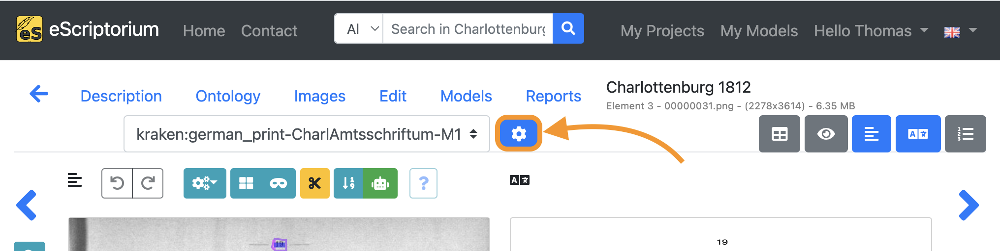
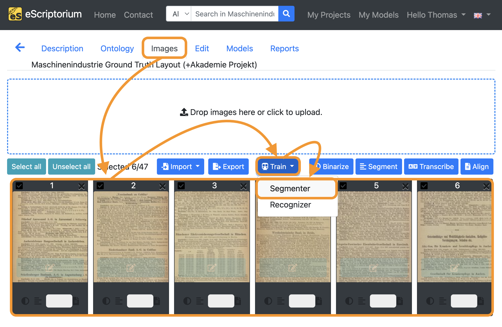

# Training with eScriptorium (*a step-by-step guide*)
**version 1.0 | January 2024**

"eScriptorium is a platform for manual or automated segmentation and text recognition of historical manuscripts and prints" [[Wikipedia](https://de.wikipedia.org/wiki/EScriptorium)]. In addition, the platform enables user-friendly training and (work-specific) fine-tuning of own layout segmentation and text recognition models directly in the browser. eScriptorium is open-source and free of charge. The trained models can be downloaded and used without restrictions.

The following step-by-step guide provides an introduction to the use of eScriptorium for training own OCR or HTR models.

# Contents

0. [Who is this guide for?](#0-who-is-this-guide-for) 
1. [How does training work?](#1-how-does-training-work) 
2. [How to train in eScriptorium?](#2-how-to-train-in-escriptorium) 
2.1. [Provide or create training data (ground truth)](#21-provide-or-create-training-data-ground-truth) 
2.2. [Where to find models](#22-where-to-find-models) 
2.3. [How to choose a model for a specific use case](#23-how-to-choose-a-model-for-a-specific-use-case)  
3. [Fine-tuning in eScriptorium](#3-fine-tuning-in-escriptorium)  
3.1. [How to fine-tune a text recognition model](#31-how-to-fine-tune-a-text-recognition-model) 
3.2. [How to fine-tune a layout segmentation model](#32-how-to-fine-tune-a-layout-segmentation-model) 
4. [Training from scratch in eScriptorium](#4-training-from-scratch-in-escriptorium) 
5. [Additional tips](#5-additional-tips) 
5.1. [Using the virtual keyboard in eScriptorium](#51-using-the-virtual-keyboard-in-escriptorium)  
5.2. [Ground truth guidelines for transcriptions](#52-ground-truth-guidelines-for-transcriptions)  
6. [License](#6-license) 

## 0. Who is this guide for?
This guide is for *intermediate* eScriptorium users with a basic understanding of the graphical interface and functionality of the platform. Here are some resources to get you started:
- [eScriptorium Quick Start Guide](https://escriptorium.readthedocs.io/en/latest/quick-start/)
- **Video tutorial** that introduces the main functions and tools can be found on YouTube: [youtube.com/watch?v=aQuwh3OaKqg](https://www.youtube.com/watch?v=aQuwh3OaKqg) (automatically generated subtitles in English are available). 

Although an attempt was made to keep the guide as accessible as possible, certain technical terms could not be avoided. Where these are to be found in the guide, we try to explain them as clearly as possible. 

This guide was created during the 3rd [OCR-D](https://ocr-d.de/en/) funding phase in the module project [*Workflow for work-specific training based on generic models with OCR-D as well as ground truth enhancement*](https://www.bib.uni-mannheim.de/en/about/projects-of-the-university-library/ocr-d-modelltraining/) (2021–2023) at [Mannheim University Library](https://www.bib.uni-mannheim.de/en/).
The module project was funded by the German Research Foundation (DFG).

**Feedback is always welcome!**
- [Jan Kamlah](https://orcid.org/0000-0002-0417-7562): `jan.kamlah[at]uni-mannheim[dot]de`
- [Thomas Schmidt](https://orcid.org/0000-0003-3620-3355): `thomas.schmidt[at]uni-mannheim[dot]de`

## 1. How does training work?
For all automated layout segmentation and text recognition tasks, eScriptorium uses the open-source OCR/HTR engine [kraken](https://kraken.re/main/index.html). The models used for layout segmentation and text recognition can be trained directly in eScriptorium with just a few clicks. Both completely new models can be trained (`training from scratch`) and existing models can be fine-tuned (`fine-tuning`) for specific use cases or domains. The training of OCR models is often carried out via the command line and requires appropriate knowledge. Since eScriptorium provides a graphical user interface, users without command line knowledge can also carry out trainings. 

It is necessary to understand the area of application of the two training variants mentioned: 

- **`Training from scratch`**: The training of a completely new model (that is not based on an already existing model) is called *training from scratch*. So-called *ground truth* is used for training, e.g. images of book pages with corresponding transcriptions that capture the text content of the pages. In order to generate robust OCR models with a training from scratch, a large amount of data is usually required (sometimes several hundred thousand lines of text). This amount can lead to problems with eScriptorium. For example, an eScriptorium project that is to be used for training from scratch with several thousand digitised documents and transcriptions can reach memory and usability limits. In such cases, training from scratch outside of eScriptorium via command line is recommended. 
- **`Fine-tuning`**: Fine-tuning, or work-specific fine-tuning, involves taking an existing model and specifically adapting it to a new use case or domain (*work-specific* in this context means that the fine-tuning is undertaken with a specific work (e.g. a historical document, manuscript or book) or group of similar works in mind). For example, a basic OCR model trained to recognize standard alphanumeric Latin characters can be unable to identify currency symbols like the Euro (€), Pound (£), or Yen (¥). To fine-tune this model for a financial domain, additional training is done using a dataset that includes these specific currency symbols. This process adjusts the model's parameters to become more sensitive to these new symbols, enabling it to accurately recognize and interpret them in financial documents where they frequently appear.

## 2. How to train in eScriptorium
### 2.1. Provide or create training data (ground truth)
In order to `train from scratch` or to `fine-tune` an existing model you must provide training data (*ground truth*). In eScriptorium this training data is provided inside a project. Training data consists of **images** (digitised pages of books, manuscripts, documents etc.) and corresponding **transcriptions** or **layout segmentations**. 

#### Ground truth for text recognition models

As the name suggests, text recognition models are used to automatically recognise the text content of an image. If you want to train or fine-tune a text recognition model you need **images** and **transcriptions**. Here is an example in eScriptorium:

 

The transcriptions attempt to capture the text content of the images as accurately as possible. If you don't have any ground truth to train with you can create it inside eScriptorium (i.e. create transcriptions for images you upload to an eScriptorium project). 

#### Ground truth for layout segmentation models

Layout segmentation models are used to automatically recognise all text regions and text lines on an image and are a preliminary stage to text recognition itself. If you want to train or fine-tune a layout segmentation model you need **images** and **layout segmentation data**. Here is an example in eScriptorium:

 

> **Note:** Chapters [3.1. How to fine-tune a text recognition model](#3-how-to-fine-tune-a-model) and [3.2. How to fine-tune a layout segmentation model](#32-how-to-fine-tune-a-layout-segmentation-model) provide a detailed introduction to the creation of ground truth for text recognition and layout segmentation training.

### 2.2. Where to find models 
Especially for fine-tuning already existing layout segmentation or text recognition models are needed. Here is a list of places where `kraken` models (the OCR/HTR engine eScriptorium uses in the background) can be found:

- **Zenodo**: [zenodo.org/communities/ocr_models](https://zenodo.org/communities/ocr_models)

All downloaded models can be uploaded to eScriptorium by clicking on **"My Models"** on the upper right corner of the screen. Click on **"Upload a model"** in the next screen and choose the model you want to upload.

### 2.3. How to choose a model for a specific use case
The performance of a model depends on various factors and must be tested for each use case. For example a model trained only on traditional Chinese characters might not perform well on German documents printed in the typeface Fraktur.

Here are some points for orientation that can help with the assessment of a model:
- Has the model been trained on **printed work** or **handwritten** documents?
- Which **languages** (e.g. English, German, Hebrew ...) and **writing systems** (e.g. Latin, Arabic, Chinese ...) does the model cover?
- Which **historical period** and which **historical typefaces** does the model cover? (i.e. is the model suitable for recognising Fraktur fonts, for example?)

> **Note:** As a rule of thumb try testing **generic models** first for your use case. *Generic* or *base models* are usually trained on a wide variety of data (different documents, typefaces etc.) of a specific domain (e.g. printed documents in French of the 18th century). If the model name and description somewhat fits the use case at hand, try testing that generic model first.

## 3. Fine-tuning in eScriptorium
In many cases, `fine-tuning` can be a time- and resource-efficient method for improving an existing layout segmentation or text recognition model for a new use case. In order to carry out fine-tuning, an existing model is required, which is adapted to the new use case during the fine-tuning training process. 

To fine-tune a model in eScriptorium, we recommend the following workflow:

1. Upload the images to be used for training
2. Test the automatic layout segmentation and text recognition for the uploaded images and evaluate the results
3. Improve layout segmentations and transcriptions that were automatically generated in `step 2`
4. Fine-tune the model used in `step 2` with the ground truth created in `step 3`
5. Evaluate the results and repeat `step 3` and `step 4` if necessary

The following steps describe this workflow in detail.

### 3.1. How to fine-tune a text recognition model 
#### Step 1: Create a new project and document
Start with creating a new eScriptorium project by browsing to the eScriptorium start page and clicking on **"My Projects"** in the upper right corner of the screen.

Next, click on the green **"Create new Project"** button.

Name your project on the next screen and click on **"Create"**.

Once the project has been created, the project overview is displayed. The project you have just created should be displayed here. Click on it.

Create a new document inside your project by clicking on the green **"Create new Document"** button.

On the next screen, give the document a name and click on **"Create"** (or **"Update"**). A message should appear in the upper right corner that the document has been created successfully.

#### Step 2: Import your images

Switch to the **"Images"** tab and upload your images either by clicking into the **"Drop images here or click to upload"** section or by clicking the **"Import"** button.

Here are the differences of both options:
- `Drop images here or click to upload`: Upload images from your hard drive in different file formats (`PNG`, `JPG`, `TIFF` etc.)
- `Import` button: Import images via `IIIF` protocol or upload `PDF` documents.

As soon as all images have been uploaded, they will appear as a preview at the bottom of the screen.

#### Step 3: Run layout segmentation on your data

> **Note 1:** Step 3 involves automatic layout segmentation. The aim here is to find a model that already works well for the uploaded images in order to improve this model afterwards in the fine-tuning step (and make it perform even better on the available data). Refer to [chapter 2.2 Where to find models](#22-where-to-find-models) if you are searching models.
> **Note 2:** We recommend working with either *RGB* or *grayscale* images as binarization can lead to losses in image detail. That's why we omit the **binarize** feature of eScriptorium in the following steps.

Select all images by clicking on the **"Select all"** button. All images in the current document should now be highlighted. 

Next, click on the **"Segment"** button.

A pop-up (*"Select a model"*) should appear in which the layout segmentation can be set:

- **1st drop-down**: Choose a layout segmentation model
- **2nd drop-down**: Choose the layout parts that you want to segment (*If no layout segmentation has been carried out so far, the "Lines and regions" setting should be selected.*)
- **3rd drop-down**: Defines the reading direction of the text (e.g. Horizontal from left to right = *Horizontal l2r*)

Next, click on the blue **"Segment"** button to start the layout segmentation. 

An orange-coloured button in the image preview shows the running layout segmentation. As soon as the segmentation for a page is complete, a message (*"Segmentation done!"*) appears in the top right-hand corner of the screen.

#### Step 4: Check the layout segmentation
Once the layout segmentation has been completed, the pages must be checked. Click on the **blue button** of the first image to activate eScriptorium's editing view.

Your screen should look like this:

On the left side of the editing view you find a preview of the image with the automatically generated layout segments in different colors. eScriptorium differentiates *3 layout regions* or *segments*:

 

1. **Text regions**: A text region usually contains several lines of text. Examples of a text region are: a paragraph, a column of text or a complete page of text. The structure of one or more text regions should correspond to the reading order and layout structure of the respective page.
2. **Line masks** (sometimes called *text lines*): A polygon mask representing a single text lines that covers all characters of the text line. eScriptorium automatically generates line masks from baselines. Therefore: while correcting the results of the automatic layout segmentation, concentrate on text regions and baselines first, as line masks will be automatically recalculated after you adjusted a baseline.
3. **Baselines**: The baseline is the line upon which most letters of a single text line sit. It's especially noticeable in handwritten or printed text, where letters without descending elements (like the lower part of "g" or "p") align along this line.

> **Note**: If the layout segmentation is correct continue with [Step 8: Run text recognition on your data](#step-8-run-text-recognition-on-your-data).

#### Step 5: Correct the text regions
Start by correcting the text regions first. Click on the **blue region icon** to toggle the "region mode":

 

Make sure that the text regions include all text content in a meaningful way. Adjust the text regions accordingly. 

**Example:** On the following page two text columns were segmented as one single text region. The adjustment reflects the actual page layout. 

 

 

#### Step 6: Correct the baselines and line masks
Continue by correcting the baselines. Deactivate region mode by clicking on the **blue region icon** again. Toggle the line mask mode by clicking on the **mask icon** till your preview looks like this:

 

Adjust the baselines in such a way that:
- one single baseline corresponds to one single line of text
- the start of a baseline is marked by a pink stroke (see the screenshot above) and should correspond with the start of the text line
- all characters of the text line sit on the baseline

**Example:** The following screenshots show incorrect baselines and their correction. For example, individual baselines extend beyond the text column boundary so that two separate lines of text are segmented as one. In addition, individual baselines do not run along the baseline of the text line.

 
 

> **Note:** After adjusting a baseline, eScriptorium automatically recalculates the corresponding line masks. Toggle those line masks by clicking on the **blue mask icon** again until the masks are shown. If a line mask should be calculated incorrectly you can adjust it by clicking on it and changing the polygon.

#### Step 7: Correct the layout segmentation for all pages
Repeat steps 5 and 6 for all available pages. Ensuring correct layout segmentation on all pages helps to improve the text recognition quality.

> **Note:** If it is necessary to correct a large amount of data, it is possible to fine-tune a layout segmentation model by repeating steps 5 and 6 for a small amount of pages, thus creating a set of training data (*ground truth*). After creating the training data, you can fine-tune a layout segmentation model and re-run the automatic layout segmentation (i.e., repeat [Step 3: Run layout segmentation on your data](#step-3-run-layout-segmentation-on-your-data)) with this fine-tuned model, in order to improve the segmentation results. Check [chapter 3.2. How to fine-tune a layout segmentation model](#32-how-to-fine-tune-a-layout-segmentation-model) for further details.

#### Step 8: Run text recognition on your data
> **Note:** Step 8 involves automatic text recognition. The aim here is to find a model that already works well for your data in order to improve this model further through fine-tuning it . Refer to [chapter 2.2 Where to find models](#22-where-to-find-models) if you are searching for layout segmentation and text recognition models.

After completing steps 3 - 6, switch back to **"Images"** tab and click on the **"Select all"** button. 

Next, click on the blue **"Transcribe"** button.

 

A pop-up should appear that lets you choose a text recognition model:

 

- **Select a model**: Choose a text recognition model
- **Select a transcription**: Select `--New--`

Click on the blue **"Transcribe"** button to start the automatic text recognition.

An orange-coloured button in the image preview shows the running text recognition. As soon as the text recognition for a page is complete, a message (*"Transcription done!"*) appears in the top right-hand corner of the screen.

 

#### Step 9: Check the transcriptions
Once text recognition has been completed, the automatically generated transcriptions must be checked.

1. Click on the **Edit** tab.
2. Next, click on the **"Segmentation view"** button in order to deactivate the layout segmentation view. 
3. Click on the **"Transcription view"** button afterwards to activate the transcription view.
4. Choose the transcription you created during `step 8` in the drop-down menu. The name of the transcription follows this structure: `OCR-engine-name:OCR-model-name`. Example: In `step 8` we chose the model `german_print` for the engine `kraken`. Hence the corresponding name of the transcription is: `kraken:german_print`.

 

If you hover your mouse cursor over one of the text lines in the transcription view on the right side of your screen, the corresponding text line of the image will be highlighted. 

 

Clicking on a text line in the transcription view will open a pop-up:

 

The automatically generated transcriptions can be checked for errors in this window. The original line of text is shown in the upper part of the pop-up. The lower part displays the transcription of the text line. The cursor keys on the keyboard (`↑` and `↓`) can be used to scroll through all available text lines.

> **Note:** Instead of improving transcription errors at this moment, first check for the approximate number of errors on each page. If the majority of the transcriptions are erroneous, it is advised to test another text recognition model for better results (i.e. repeat [Step 8: Run text recognition on your data](#step-8-run-text-recognition-on-your-data) with a different model). However, if there are only a few errors on each page (rule of thumb: 1 to 2 errors every 2 to 3 text lines), you can continue with improving the transcriptions in [Step 10: Improve the transcriptions and create ground truth](#step-10-improve-the-transcriptions-and-create-ground-truth).

#### Step 10: Improve the transcriptions and create ground truth

`Step 10` corrects transcription errors in order to generate training data (*ground truth*) for fine-tuning a text-recognition model. 

1. Click on the **Edit** tab.
2. Next, click on the **"Segmentation view"** button in order to deactivate it. 
3. Click on the **"Text view"** button afterwards to enable the plain text view.
4. Choose the transcription you created during `step 8` in the drop-down menu.

 

Select **all text lines** (`STRG + A` on Windows or `⌘ + A` on Mac) in the text view and **copy** them (`STRG + C` on Windows or `⌘ + C` on Mac):

 

Choose **"manual"** in the transcription drop-down and **paste** (`STRG + V` on Windows or `⌘ + V` on Mac) the transcription you just copied into the text view:

 

> **Note:** This copying process has the following purpose: In the "manual" transcription, we record the **correct transcription** (= *ground truth*) of the text content of the respective page, which will later be used for training. The automatically generated transcription (created in step 8), which still contains errors, serves as the basis for the correction. The corrections are made in the "manual" transcription, as this ensures that there is only one transcription in our document in which checked and corrected training data can be found, namely the "manual" transcription.

Next, deactivate the **"text view"** and activate the **"transcription view"**:

 

Click on the first text line in the **"transcription view"**. The example below shows an error in the generated transcription. We fix it so that the transcription matches the original text line:

 

After the first text line has been corrected, press the `Enter ↲` key to check and correct the next text line. The cursor keys on the keyboard (`↑` and `↓`) can also be used to scroll through all available text lines of the current page. 

After you have finished correcting the current page, proceed with the next one. *Be sure to follow all instructions of `step 10` (i.e. using the "manual" transcription workflow).*

#### Addendum 1: How much training data (ground truth) do I need?
> Experience has shown that even a **small amount of training data** is enough to start fine-tuning an existing text recognition model that already works somewhat well on your data. With regard to fine-tuning, an **iterative approach** should be followed: 
> 1. Create 2 to 3 pages of training data by correcting the automatically generated transcriptions as shown in step 10. 
> 2. [Fine-tune the text recognition model](#step-11-fine-tune-a-text-recognition-model) you have used in step 8 with the corrected ground truth . 
> 3. [Test and evaluate](#step-12-re-run-text-recognition-and-evaluate-your-fine-tuned-model) if the fine-tuned model yields better transcriptions on your data than before.
> 4. If not, repeat 1 to 3 to create more training data. Fine-tune new models and evaluate them on your data until the results are satisfactory. 
>
> An **example workflow** with iterations can look like this:
> 1. Create 2 pages of training data by correcting transcriptions generated by a text recognition model
> 2. Fine-tune the text recognition model you have already used with those 2 pages of training data
> 3. Evaluate if the fine-tuned model produces better transcriptions
> 4. If the results are better but still need improvement, create additional training data, e.g. another 4 pages 
> 5. Fine-tune the first model again with your 6 pages of ground truth
> 6. Evaluate if the second fine-tuned model produces better transcriptions
> 7. Continue by iterating ...
>
> **Note:** At first glance this process looks time consuming, as you have to repeat certain steps – creating of training data, training itself, evaluation – again. Although this is true, iteration can ultimately lead to a rapid improvement of the generated transcripts, as the fine-tuned models get better with each training and thus generate fewer transcription errors that need to be improved.

#### Addendum 2: Always follow transcription guidelines!
> Transcription guidelines are a set of rules and instructions provided to individuals who are manually transcribing or annotating text from various sources. These guidelines serve to standardize the transcription process, ensuring consistency, accuracy, and clarity in the resulting transcribed data. Guidelines should be used for both the creation and correction of transcriptions. Refer to the chapter [Ground truth guidelines for transcriptions](#52-ground-truth-guidelines-for-transcriptions) to learn more.

#### Step 11: Fine-tune a text recognition model

If you have created a sufficient amount of training data (refer to section [How much training data (ground truth) do I need for fine-tuning?](#how-much-training-data-ground-truth-do-i-need-for-fine-tuning)), the fine-tuning process itself is simple.

1. Click on the **"Images"** tab.
2. Click on the **"Select all"** button.
3. Click on the blue **"Train"** button.
4. Click on **"Recognizer"**.

 

A pop-up should open, that looks like this:

 

- **1st drop-down**: Choose the "manual" transcription where you saved the corrected ground truth
- **Field `New model`**: Choose a name for your fine-tuned model
   - *We recommend using descriptive names, that should capture the following information (as this helps later when identifying a model in a large number of other models)*:
      - `Name of parent model`: name of the model you fine-tune. In our example `german_print`.
      - `Name of the documents you train with`: a descriptive name for identifying the data you used for fine-tuning. In our example we use the abbreviation `CharlAmtsschriftum` as we are training with pages from this respective collection.
      - `Model number`: Record the number or generation of the new model. `M1`, as in the example, means: the first fine-tuned model.
- **2nd drop-down**: Select the text recognition model you want to fine-tune. This should be the model you worked with in [step 8](#step-8-run-text-recognition-on-your-data), i.e. the text recognition model that already worked quite well on your data.  In our example this model is `german_print`.

Lastly, click on the blue **"Train"** button to start the fine-tuning. 

A running training is shown as below:

 

If you want to view the training progress, click on **"My models"**:

 

The model you are currently training will appear in this overview. By clicking on the button **"Toggle versions"** you can view all currently finished training epochs as well. You will be notified as soon as the training has finished.

#### Optional: Fine-tuning Tesseract and Calamari models in eScriptorium
> **Note:** This section is only relevant for versions of eScriptorium in which the training environment has been extended for the OCR engines **Tesseract** and **Calamari**.

To use an OCR engine other than `kraken` (the eScriptorium default engine) for fine-tuning, `step 11` can be adapted as follows:

After you have created a sufficient amount of training data (refer to section [How much training data (ground truth) do I need for fine-tuning?](#how-much-training-data-ground-truth-do-i-need-for-fine-tuning)), start the fine-tuning process like this:

1. Click on the **"Images"** tab.
2. Click on the **"Select all"** button.
3. Click on the blue **"Train"** button.
4. Click on **"Recognizer"**.

 

A pop-up should open, that looks like this:

Choose 

#### Step 12: Re-run text recognition and evaluate your fine-tuned model
After the training has finished your fine-tuned text recognition model becomes available for testing. This step helps identifying if the fine-tuned model produces better results than the previously used base model in `step 8`.

1. Switch back to your document and click on the **"Images"** tab.
2. Select one or more pages.
   - *Select a page / pages that were not part of the training itself, in order to assure optimal evaluation results*.
3. Click on the blue **"Transcribe"** button.

A pop-up should appear that lets you choose a text recognition model:

 

- **Select a model**: Choose the model you have fine-tuned in `step 11`
- **Select a transcription**: Select `--New--`

Click on the blue **"Transcribe"** button to start the automatic text recognition.

An orange-coloured button in the image preview shows the running text recognition. As soon as the text recognition for a page is complete, a message (*"Transcription done!"*) appears in the top right-hand corner of the screen.

 

Once text recognition has been completed, check the generated transcriptions.

1. Click on the **Edit** tab.
2. Next, click on the **"Segmentation view"** button in order to deactivate the layout segmentation view. 
3. Click on the **"Transcription view"** button afterwards to activate the transcription view.
4. Choose the transcription you created with your fine-tuned model in the drop-down menu. 

 

Evaluate the accuracy of your fine-tuned model by comparing the transcriptions of the base model you have used in `step 8` versus the transcriptions you just generated with your fine-tuned model.

To do this, click on the blue **"cogwheel icon"** next to the drop-down for the transcription selection:

 

Select the transcription you created in `step 8` (the transcription of your base model) and the transcription you have just created using your fine-tuned model:

 

Exit the pop-up by clicking on the **"x"** in the top right corner.

Click on a text line in the transcription view to open the eidtor pop-up and click on the **"Toggle transcription comparison"** link.

 

A comparison of the two selected transcriptions for the currently displayed text line is now shown in the lower part of the pop-up. Highlighted characters show transcription differences between the two versions so that the transcription result of the fine-tuned model can be checked quickly, in order to assess if the fine-tuning produced better results than the base model.

#### Step 13: Iterate 
If the evaluation of `step 12` produced unsatisfactory results, try iterating `steps 10-12`, i.e. create more training data by correcting the transcriptions of additional pages and fine-tune another model with this data.

Check [Addendum 1: How much training data (ground truth) do I need?](#addendum-1-how-much-training-data-ground-truth-do-i-need) for more details.

### 3.2. How to fine-tune a layout segmentation model 
> **Note:** The aim of fine-tuning a layout segmentation model is to improve the automatic segmentation of text regions, baselines and line masks. In order to fine-tune an existing layout segmentation model, the existing model (*base model*) should already work *reasonably* well on your data. 
>
> **Examples**: A base model that has been trained on a writing system such as Arabic (reading direction right to left) will most likely not be improved by fine-tuning with training data that has a reading direction from left to right. Similarly, a base model that has been trained primarily on rather uniform book pages (e.g. English novels from the 18th century with a homogeneous paragraph-by-paragraph layout) will have problems with the segmentation of complex tables, as these layout structures were underrepresented in the training data or played no role at all. Experience has shown that fine-tuning such a base model with a few pages of training data does not lead to useful results. Hence we recommend finding a layout segmentation model that works reasonably well on your data in the first place.

As with fine-tuning a text recognition model, we recommend using an **iterative approach** for creating training data:

#### Step 1: Create training data (*ground truth*)
Create 5 to 10 pages of training data by correcting the automatically generated layout segmentation as shown in `steps 3 to 7` of chapter [3.1. How to fine-tune a text recognition model](#31-how-to-fine-tune-a-text-recognition-model).

#### Step 2: Fine-tune your layout segmentation model
2. Click on the **"Images"** tab.
3. Select **all pages with your corrected training data** (select one page, hold the `shift` key and then select the other pages with your training data).
4. Click on the blue **"Train"** button and choose **"Segmenter"**.

 

A pop-up should open, that looks like this:

 

- **Field `New model`**: Choose a name for your fine-tuned model
   - *We recommend using descriptive names, that should capture the following information (as this helps later when identifying a model in a large number of other models)*:
      - `Name of parent model`: name of the model you fine-tune. In our example `ubma_segmentation`.
      - `Name of the documents you train with`: a descriptive name for identifying the data you used for fine-tuning. In our example we use the abbreviation `Maschinenindustrie` as we are training with pages from this respective collection.
      - `Model number`: Record the number or generation of the new model. `M1`, as in the example, means: the first fine-tuned model.
- **Drop-down**: Select the layout segmentation model you want to fine-tune. This should be the model you worked with in `step 3`, i.e. the layout segmentation model that already worked quite well on your data.

Finally, click on the blue **"Train"** button and start the fine-tuning.

A running training is shown as below:

 

If you want to view the training progress, click on **"My models"**:

 

The model you are currently training will appear in this overview. By clicking on the button **"Toggle versions"** you can view all currently finished training epochs as well. You will be notified once the training has finished.

#### Step 3: Re-run layout segmentation evaluate your fine-tuned model
After the training has finished your fine-tuned layout segmentaton model becomes available for testing. This step helps identifying if the fine-tuned model produces better results than the previously used base model.

1. Switch back to your document and click on the **"Images"** tab.
2. Select one or more pages to test your fine-tuned model on.
   - *Select a page / pages that were not part of the training itself, in order to assure optimal evaluation results*.
3. Click on the blue **"Segment"** button.

A pop-up should appear that lets you choose a layout segmentation model:

- **Select a model**: Choose the model you have fine-tuned in `step 2`
- Click on the blue **"Segment"** button to start the layout segmentation.

Once the layout segmentation has finished, check the results.

#### Step 4: Iterate
If the evaluation of `step 3` produced unsatisfactory results, try iterating `steps 1-3`, i.e. create more training data fine-tune another segmentation model with this data.

## 4. Training from scratch in eScriptorium
> **Note:** When training from scratch, you typically need a substantial amount of  training data to achieve acceptable accuracy. The more diverse the training data is, the better your model will generalize to a wide range of documents and typefonts. eScriptorium can reach its limits with such training, as usability and speed can suffer greatly when several thousand pages of training data have to be loaded into a single document. For training from scratch with a large amount of data, the training should therefore be carried out outside of eScriptorium via the CLI (an example can be found here: [Training German Handwriting](https://github.com/UB-Mannheim/kraken/wiki/Training-German-Handwriting#training-2023-05-12)). 
> In the following, a training from scratch for a less extensive data set is shown to explain the principle and procedure.

#### Step 1: Create or import training data (*ground truth*)
Create a new project and document and follow `steps 1 to 10` of chapter [3.1. How to fine-tune a text recognition model](#31-how-to-fine-tune-a-text-recognition-model).

#### Step 2: Train from scratch 
After you created or imported your training data, follow these steps to start to train from scratch:

1. Click on the **"Images"** tab inside the document view.
2. Click on the **"Select all"** button.
3. Click on the blue **"Train"** button.
4. Choose either **"Recognizer"** or **"Segmenter"**, depending on what kind of model you want to train.

 

5. A pop-up should appear in which the settings for the training can be made as follows:

 

- **1st drop down**: Select the **transcriptions** you want to use for training 
   - *this option is only available if you chose to train a **"Recognizer"** model*
- **Field `New model`**: Choose a name for your model.

Finally, click on the blue **"Train"** button to start training from scratch.

A running training is shown as below:

 

If you want to view the training progress, click on **"My models"**:

 

The model you are currently training will appear in this overview. By clicking on the button **"Toggle versions"** you can view all currently finished training epochs as well. You will be notified once the training has finished.

#### Step 3: Test and evaluate your model
After the training has finished your model becomes available for testing. Depending on what you trained (either a **Recognizer** or a **Segmenter** model), continue by switching to the **"Images"** section of your document.

1. Click on the **"Images"** tab.
2. Select a page you want to test your newly trained model on.
   - *Select a page that was not part of the training itself, in order to assure optimal evaluation results*.
3. Click on the blue **"Segment"** button if you have trained a **Segmenter** model or click on the blue **"Transcribe"** button if you have trained a **Recognizer** model.

4. A pop-up should appear that lets you choose your model:

**Select** your model and start the **Layout segmentation** / **Text recognition** by clicking on the blue **"Transcribe"** / **"Segment"** button.

Once the **Layout segmentation** / **Text recognition** has finished for the selected page, check the results for quality.

## 5. Additional tips
### 5.1. Using the virtual keyboard in eScriptorium
#### What are virtual keyboards?
Virtual keyboards are especially helpful when transcribing historical documents, as a lot of characters in those documents are not available on standard modern day keyboards.

Consider this example:

 

The original text line shows a historical glyph, namely the `long s` which is a common character in German documents printed in Fraktur (*Blackletter*). You won't find the `long s` on a modern day keyboard, hence it is not possible to use the `long s` without major detours. 

The **virtual keyboard** is a helpful aid in such cases. Every eScriptorium user can create their own virtual keyboards or import existing ones. The Unicode symbols stored in the respective virtual keyboard can be freely assigned.

Whenever you are editing text lines in the transcriptrion view, you able to toggle the **"virtual keyboard"** on or off.

1. With the text line editor open, click on the blue **keyboard icon** in the top left corner.
2. Next, click inside the editor.

 

The virtual keyboard should now be displayed. You can switch between different virtual keyboards by clicking on the **dropdown menu.** If you have not imported a virtual keyboard yet, click on the **"Manage keyboards"** button.

 

With the **Keyboards manager** you are able to import existing keyboards or create new keyboard layouts from scratch.

#### Importing a virtual keyboard
1. Click on the blue **"Import a keyboard"** icon.
2. A new pop up should appear. Click on the grey **"Choose a file"** button.

 

3. Download the `escriptorium-keyboard-German-Fraktur.json` from the `virtual-keyboards` folder of this repository to your computer.
4. In eScriptorium, choose the file you just downloaded in your file browser and open it.
5. Next, click on the blue **"Import"** button. A message should appear, if you successfully imported the keyboard.

 

6. Lastly, click on the **"Use"** button to activate the virtual keyboard you just importet.

 

You are now able to choose the imported virtual keyboard in the drop down menu. Clicking on one of the glyphs inside the virtual keyboard will paste it into the transcription.

 

> **Note:** More information about virtual keyboards can be found in the eScriptorium documentation: [escriptorium-tutorial.readthedocs.io/en/latest/virtual_keyboard/](https://escriptorium-tutorial.readthedocs.io/en/latest/virtual_keyboard/)

### 5.2. Ground truth guidelines for transcriptions
#### What are transcription guidelines?
Transcription guidelines are a set of rules and instructions provided to individuals who are manually transcribing or annotating text from various sources. These guidelines serve to standardize the transcription process, ensuring consistency, accuracy, and clarity in the resulting transcribed data. 

#### Why should you use transcription guidelines?
- **Improved text recognition accuracy**: Transcription guidelines help maintain consistency and standardization in how text is transcribed. This consistency reduces errors and discrepancies in the ground truth data, which in turn leads to higher OCR accuracy.
- **Better ground truth quality**: Well-defined guidelines help human transcribers understand how to handle ambiguous cases, special characters, and complex formatting. This results in higher-quality training data, with fewer transcription errors and better alignment with the OCR system's expectations.
- **Ensured data consistency**: When multiple individuals are involved in creating ground truth data, transcription guidelines ensure that they all follow the same rules and conventions. This consistency is essential for training robust OCR models, as discrepancies in the data can lead to confusion during training, which can result in less accurate text recognition modles.
- **Better validation and evaluation**: When you have well-documented transcription guidelines, it becomes easier to validate and evaluate the performance of your OCR model. You can compare the OCR output to the ground truth data using established criteria, making it clear whether the system is meeting your accuracy requirements.

#### Best practices
The [OCR-D Ground Truth Guidelines](https://ocr-d.de/en/gt-guidelines/trans/) are a good starting point for developing project specific transcription guidelines. The guidelines are organized into three distinct levels to help replicate the unique characteristics of printed text in a transcription. These characteristics can be reproduced with varying degrees of complexity, which is represented by the three OCR-D ground truth levels. 

To illustrate this concept, consider the following example:

| Image | Level 1 | Level 2 | Level 3 |
|-------|---------|---------|---------|
 |`dass`|`daſs`|`daſs`|

As you can see, a transcription of the image produces different results when transcribing according to level 1 or level 2 / 3 of the OCR-D GT guidelines. In other words: transcriptions are *standardized* by using one of the three different levels.

> **Note:** In every project, decisions need to be made regarding the **transcription of print-specific features** (in the example above, *the representation of the long 's'* that regularly appears in German works printed in Fraktur). The OCR-D guidelines are a valuable resource for providing initial guidance in this regard. Furthermore, they collect real world examples, that might help in creating your own guidelines.

## 6. License
This guide is licensed under [CC-BY 4.0](https://creativecommons.org/licenses/by/4.0/).
