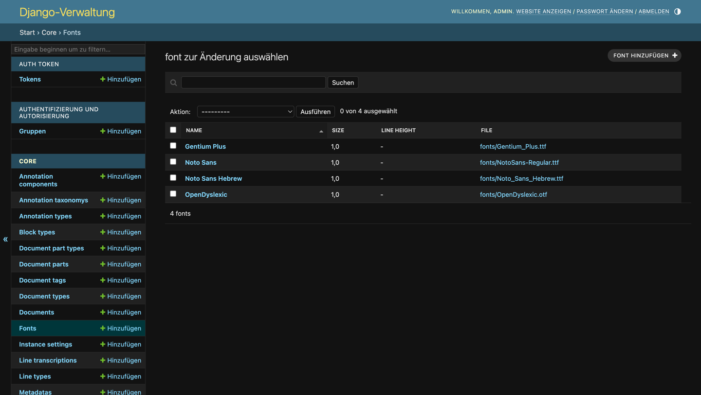
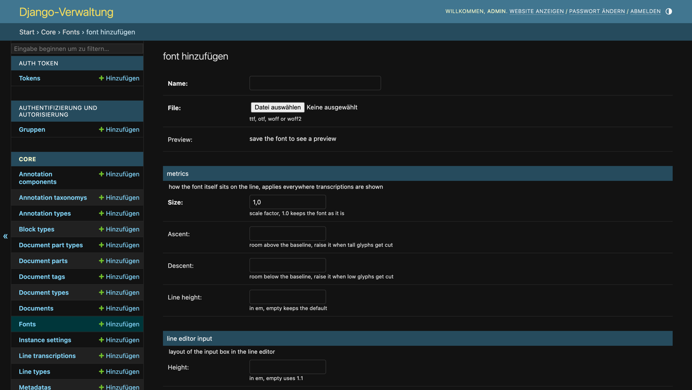

Diese Seite beschreibt instanzspezifische Funktionen und deren Einrichtung durch den Administrator von eScriptorium.

## 1. Transkriptionsschriftarten einrichten

Die Schriftart, mit der die Transkriptionszeilen im Bearbeitungsfenster angezeigt werden, ist in eScriptorium ein Standardmerkmal, das auf Dokument-, Projekt- oder Benutzerebene gewählt wird (siehe [neues Interface, Abschnitt 4.2](./Nutzungsanleitung_neues_Interface_eScriptorium.md#42-schriftart-für-die-transkription-wählen)). Welche Schriftarten dabei zur Auswahl stehen, richtet der Administrator der Instanz ein.

### 1.1. Übersicht der Schriftarten

Im Django-Admin (unter „Core“) ist das Modell **„Fonts“** aufgeführt. Es enthält alle der Instanz hinterlegten Schriftarten:

### 1.2. Eine neue Schriftart hinterlegen

Eine neue Schriftart wird über „Fonts“ → „Add“ angelegt:

- **Name:** Der in den Auswahllisten der Benutzer angezeigte Name (z. B. „Noto Sans“).
- **File:** Die Schriftdatei im Format `ttf`, `otf`, `woff` oder `woff2`.
- **Preview:** Zeigt nach dem Speichern die gewählte Schrift in einer Beispielzeile an.
- **Metrik (metrics):** Steuert, wie die Schrift selbst auf der Zeile sitzt und überall dort wirkt, wo Transkriptionen angezeigt werden. *Size* ist ein Skalierungsfaktor (1.0 belässt die Schrift unverändert), *Ascent* den Abstand über der Grundlinie (erhöhen, wenn hohe Zeichen abgeschnitten werden), *Descent* den Abstand unter der Grundlinie (erhöhen, wenn tiefe Zeichen abgeschnitten werden) und *Line height* den Zeilenabstand in em (leer lässt den Standard).
- **Eingabefeld der Zeilenansicht (line editor input):** Steuert die Gestaltung des Eingabefelds in der Zeilenansicht (Höhe, Innenabstände oben/unten, Außenabstände oben/unten und vertikale Ausrichtung), jeweils in em; leere Werte lassen die jeweiligen Standardwerte gelten.

Nach dem Speichern steht die Schriftart allen Benutzern in den Auswahllisten zur Verfügung.

### 1.3. Standard-Schriftarten der Instanz

Die Instanz der UB Mannheim stellt die Transkriptionsschriftarten **Gentium Plus**, **Noto Sans**, **Noto Sans Hebrew**, **OpenDyslexic** und **Abyssinica** (Schrift für äthiopische Schriften) vor. Die Schriftdateien können über die oben beschriebene Funktion im Django-Admin nachinstalliert oder aktualisiert werden; eine vorhandene Schriftart (erkannt am Namen) wird nicht doppelt angelegt, sondern übersprungen.

## 2. Web-Statistik (Matomo)

eScriptorium kann – auf Wunsch – eine Web-Statistik auf Basis von [Matomo](https://matomo.org/) ausführen. Die Auswertung ist optional, wird auf Instanzebene konfiguriert und betrifft die gesamte Oberfläche (also auch Seiten ohne Login); die Einbindung respektiert dabei die ortsbezogene Datenschutzkonfiguration.

- Die Statistik wird durch die Variablen `MATOMO_URL` (URL der Matomo-Instanz, z. B. `https://ub-monitor.bib.uni-mannheim.de/matomo/`) und `MATOMO_SITE_ID` (die Kennung des betroffenen Matomo-Projekts) aktiviert.
- Sind beide Werte gesetzt, fügt eScriptorium das Matomo-Skript in jede Seite ein; bleiben sie leer, wird keine Statistik geladen.
- So lässt sich die Nutzung der Instanz (Seitenaufrufe, Klicks) anonymisiert auswerten, ohne dass eine Analyse-Drittanbieterdatenbank kontaktiert wird.
