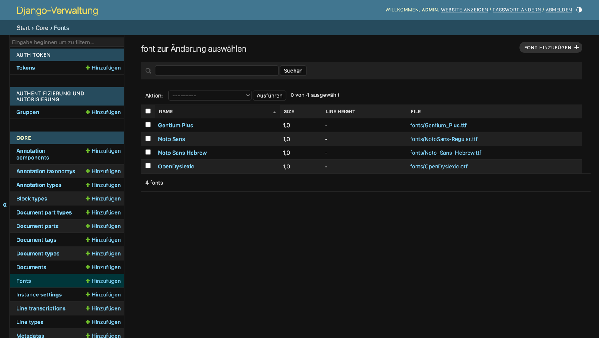
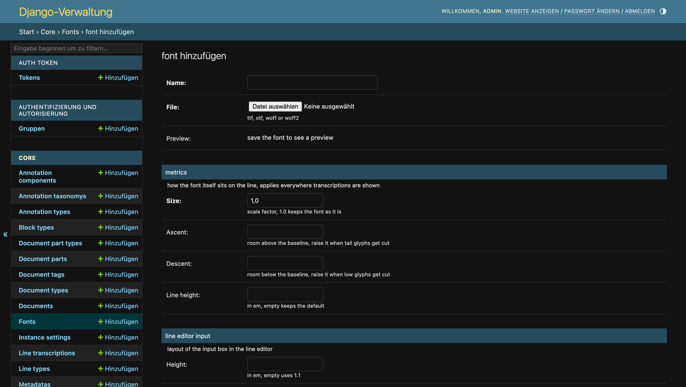

Diese Seite beschreibt Funktionen, die von einem Administrator von eScriptorium eingerichtet werden: Standardmerkmale, die pro Instanz konfiguriert werden, sowie eine Erweiterung, die die Instanz der UB Mannheim über das Standard-Release hinaus bietet.

## Inhalt

- [1. Transkriptionsschriftarten einrichten](#1-transkriptionsschriftarten-einrichten)
  - [1.1. Übersicht der Schriftarten](#11-übersicht-der-schriftarten)
  - [1.2. Eine neue Schriftart hinterlegen](#12-eine-neue-schriftart-hinterlegen)
  - [1.3. Standard-Schriftarten der Instanz](#13-standard-schriftarten-der-instanz)
- [2. Benutzer einladen](#2-benutzer-einladen)
  - [2.1. Einzelne Einladung](#21-einzelne-einladung)
  - [2.2. Massenversand](#22-massenversand)
- [3. API-Token und REST-API](#3-api-token-und-rest-api)
- [4. Web-Statistik (Matomo)](#4-web-statistik-matomo)
- [5. Wartungsbefehle (manage.py)](#5-wartungsbefehle-managepy)

## 1. Transkriptionsschriftarten einrichten

Die Schriftart, mit der die Transkriptionszeilen im Bearbeitungsfenster angezeigt werden, ist in eScriptorium ein Standardmerkmal, das auf Dokument-, Projekt- oder Benutzerebene gewählt wird (siehe [neues Interface, Abschnitt 1.12](./Nutzungsanleitung_neues_Interface_eScriptorium.md#112-schriftart-für-die-transkription-wählen)). Welche Schriftarten dabei zur Auswahl stehen, richtet der Administrator der Instanz ein.

### 1.1. Übersicht der Schriftarten

Im Django-Admin (unter „Core“) ist das Modell **„Fonts“** aufgeführt. Es enthält alle der Instanz hinterlegten Schriftarten:

### 1.2. Eine neue Schriftart hinterlegen

Eine neue Schriftart wird über „Fonts“ → „Add“ angelegt:

- **Name:** Der in den Auswahllisten der Benutzer angezeigte Name (z.&nbsp;B. „Noto Sans“).
- **File:** Die Schriftdatei im Format `ttf`, `otf`, `woff` oder `woff2`.
- **Preview:** Zeigt nach dem Speichern die gewählte Schrift in einer Beispielzeile an.
- **Metrik (metrics):** Steuert, wie die Schrift selbst auf der Zeile sitzt und überall dort wirkt, wo Transkriptionen angezeigt werden. *Size* ist ein Skalierungsfaktor (1.0 belässt die Schrift unverändert), *Ascent* den Abstand über der Grundlinie (erhöhen, wenn hohe Zeichen abgeschnitten werden), *Descent* den Abstand unter der Grundlinie (erhöhen, wenn tiefe Zeichen abgeschnitten werden) und *Line height* den Zeilenabstand in em (leer lässt den Standard).
- **Eingabefeld der Zeilenansicht (line editor input):** Steuert die Gestaltung des Eingabefelds in der Zeilenansicht (Höhe, Innenabstände oben/unten, Außenabstände oben/unten und vertikale Ausrichtung), jeweils in em; leere Werte lassen die jeweiligen Standardwerte gelten.

Nach dem Speichern steht die Schriftart allen Benutzern in den Auswahllisten zur Verfügung.

### 1.3. Standard-Schriftarten der Instanz

Die Instanz der UB Mannheim stellt die Transkriptionsschriftarten **Gentium Plus**, **Noto Sans**, **Noto Sans Hebrew**, **Hebrew-Samaritan** (Schrift für die samaritanische Schrift, von Yoram Gnat, erstellt mit FontForge 2.0, lizenziert unter GPL 2), **OpenDyslexic** und **Abyssinica** (Schrift für äthiopische Schriften) vor. Die Schriftdateien können über die oben beschriebene Funktion im Django-Admin nachinstalliert oder aktualisiert werden; eine vorhandene Schriftart (erkannt am Namen) wird nicht doppelt angelegt, sondern übersprungen.

## 2. Benutzer einladen

Neue Benutzer werden über Einladungen per E-Mail registriert: Der Empfänger erhält eine E-Mail mit einem Link, über den er sein Konto anlegt (Login, E-Mail-Adresse, Vor- und Nachname, Passwort). Die Einladeseite ist für alle Benutzer sichtbar, die die Berechtigung „Benutzer einladen“ (*can_invite*) haben – dazu zählen in der Regel Administrator:innen; sie kann über das Benutzermenü oben rechts unter „Einladen“ geöffnet werden.

### 2.1. Einzelne Einladung

Im Modus „Einzeln“ geben Sie die Angaben zum Empfänger ein: E-Mail-Adresse, optional Vor- und Nachname sowie optional das **Team** (Gruppe), in das der Benutzer nach der Registrierung aufgenommen werden soll, und ein optionales **Ablaufdatum** für das Konto. Mit „Absenden“ wird die Einladungsmail verschickt.

### 2.2. Massenversand

Im Modus „Massenversand“ können mehrere Einladungen auf einmal versendet werden: Entweder wird eine CSV-Datei mit einer E-Mail-Adresse pro Zeile hochgeladen oder die Adressen werden direkt eingegeben (eine pro Zeile, optional in der Form „Vorname Nachname <adresse>"). Auch hier können optional Team und Ablaufdatum festgelegt werden; ungültige Adressen werden übersprungen.

Versendete Einladungen (mit Empfänger, Team und Status) können über das Benutzermenü unter „Profileinstellungen“ → „Einladungen“ eingesehen werden.

## 3. API-Token und REST-API

eScriptorium stellt eine REST-API (DRF) bereit, mit der sich Projekte, Dokumente, Transkriptionen, Bilder, Annotationen, Modelle, Schriftarten und mehr per HTTP verwalten lassen. Jeder Benutzer besitzt einen persönlichen **API-Token**:
- Den Token finden Sie unter „Profileinstellungen“ → „API-Schlüssel“; die Buttons daneben kopieren ihn in die Zwischenablage bzw. erzeugen einen neuen Token (der alte wird dabei ungültig).
- Autorisiert wird mit dem Header `Authorization: Token <token>`; die Seite zeigt ein `curl`-Beispiel.

Die API ist selbst dokumentiert (OpenAPI): Unter `/api/schema/` liegt das Schema, `/api/swagger/` die interaktive Swagger-UI und `/api/redoc/` eine ReDoc-Darstellung.

## 4. Web-Statistik (Matomo)

Die Instanz der UB Mannheim bietet – als Erweiterung gegenüber dem Standard-Release, die derzeit als Pull Request für die Standardversion vorgeschlagen ist – eine optionale Web-Statistik auf Basis von [Matomo](https://matomo.org/). Die Auswertung wird auf Instanzebene konfiguriert und betrifft die gesamte Oberfläche (also auch Seiten ohne Login); die Einbindung respektiert dabei die ortsbezogene Datenschutzkonfiguration.

- Die Statistik wird durch die Variablen `MATOMO_URL` (URL der Matomo-Instanz, z.&nbsp;B. `https://ub-monitor.bib.uni-mannheim.de/matomo/`) und `MATOMO_SITE_ID` (die Kennung des betroffenen Matomo-Projekts) aktiviert.
- Sind beide Werte gesetzt, fügt eScriptorium das Matomo-Skript in jede Seite ein; bleiben sie leer, wird keine Statistik geladen.
- So lässt sich die Nutzung der Instanz (Seitenaufrufe, Klicks) anonymisiert auswerten, ohne dass eine Analyse-Drittanbieterdatenbank kontaktiert wird.

## 5. Wartungsbefehle (manage.py)

Für den Betrieb stellt eScriptorium eine Reihe von Django-Verwaltungsbefehlen zur Verfügung, die als **`manage.py <Befehl> [Optionen]`** ausgeführt werden. In der Container-Installation (docker-compose) werden sie in den App-Containern (z.&nbsp;B. `web`) mit `docker compose exec web python manage.py <Befehl> [Optionen]` ausgeführt. Befehle, die eine geplante, regelmäßige Ausführung voraussetzen, sind im Folgenden entsprechend markiert.

### 5.1. cleanup_expired_downloads

Entfernt abgelaufene Download-Dateien: Zuerst die Datei auf der Platte, dann die Datenbankzeile. Downloads ohne Ablaufdatum werden nicht berührt. Der Befehl ist idempotent und sicher wiederholt ausführbar.

- `--dry-run` – zeigt nur an, was gelöscht würde, ohne etwas zu ändern.
- Geplante Ausführung (z.&nbsp;B. täglich um 03:15 Uhr): `15 3 * * * cd /srv/app && python manage.py cleanup_expired_downloads`

### 5.2. cleanup_ghost_tasks

Markiert TaskReports als abgestürzt, deren Celery-Aufgabe nicht mehr existiert: „Laufende“ Berichte, deren Prozess nicht mehr läuft, sowie „In der Warteschlange“-Berichte, deren Aufgabe weder in einer Queue noch bei einem Worker zu finden ist (z.&nbsp;B. weil die Nachricht konsumiert, aber verloren ging).

- `--min-age SEKUNDEN` – räumt nur „In der Warteschlange“-Berichte aus, die mindestens so alt sind (Standard: 60 Sekunden).
- `--verbosity {1,2,3,4}` – Steuerung der Protokollierung (ERROR/WARNING/INFO/DEBUG).
- Funktioniert nur, wenn die Worker und der Redis-Broker erreichbar sind; ist das nicht der Fall, wird nichts gelöscht (um laufende Aufgaben nicht fälschlich als abgestürzt zu markieren).
- Geplante Ausführung, z.&nbsp;B. stündlich.

### 5.3. check_quotas

Schickt Benutzern, die ihre Kontingente (Speicherplatz, CPU-Minuten oder GPU-Minuten) erschöpft haben, eine E-Mail. Pro Benutzer und Kontingent wird innerhalb von `QUOTA_NOTIFICATIONS_TIMEOUT` Tagen (Standard: 3) nicht erneut geschrieben. Läuft auf Instanzen, bei denen Kontingente deaktiviert sind (`DISABLE_QUOTAS`), leer.

- Geplante Ausführung, z.&nbsp;B. täglich.

### 5.4. index

Erzeugt die Volltextsuche (Elasticsearch/OpenSearch): Es wird je Transkriptionszeile ein Suchdokument angelegt. Damit lässt sich nach dem Anlegen neuer Inhalte, nach Berechtigungsänderungen oder nach Problemen mit der Suche neu indizieren.

- `--project-pks PK [PK ...]` – nur die angegebenen Projekte indizieren (Standard: alle).
- `--document-pks PK [PK ...]` – nur die angegebenen Dokumente indizieren.
- `--part-pks PK [PK ...]` – nur die angegebenen Dokumentteile indizieren.
- `--drop` – vorhandenen Index vor dem Neuanlegen löschen (z.&nbsp;B. bei Konflikt des Index-Mappings).
- Voraussetzungen: `DISABLE_ES_SEARCH` muss auf `False` gesetzt sein und der als `ES_SEARCH_URL` definierte Host muss erreichbar sein.

### 5.5. qualify_models

Stellt Architekturqualifikations-Aufgaben für OCR-Modelle in die Celery-Warteschlange; damit lassen sich Modelle (neu)qualifizieren, falls die dafür vorgesehene Datenmigration den Broker nicht erreicht hat.

- `--all` – auch Modelle, die bereits eine Architektur besitzen, erneut qualifizieren (Standard: nur Modelle ohne Architektur).

### 5.6. cleanup_models_versioning

Entfernt aus der Modellversionierung (Versionshistorie) alles, was älter als `MODELS_VERSION_RETENTION` Tage (Standard: 30) ist. Ist `MODELS_VERSION_RETENTION` auf 0 gesetzt, wird nichts gelöscht.

- `--dry-run` – gibt nur die Anzahl betroffener Modelle aus, ohne Datei- oder Datenbankänderungen.
- Geplante Ausführung, z.&nbsp;B. täglich.

### 5.7. cleanup_orphan_models

Räumt Modellreste auf: Es werden `OcrModel`-Zeilen ohne zugehörige Datei sowie Modellverzeichnisse unter `MEDIA_ROOT/models` gelöscht, auf die kein `OcrModel` mehr verweist. Modelle, bei denen das Training-Flag gesetzt ist, werden trotz fehlender Datei behalten (möglicherweise ein steckendes Training). Zum Schluss werden Modelle gemeldet, die auf eine nicht vorhandene Datei verweisen (Warnung, keine Löschung).

- `--dry-run` – gibt nur aus, was aufgeräumt würde, ohne Datei- oder Datenbankänderungen.
- Geplante Ausführung, z.&nbsp;B. wöchentlich.

### 5.8. calculate_avg_confidences

Berechnet die durchschnittliche Zeichen-Confidence für alle vorhandenen OCR-/HTR-Zeilen (mit Confidence-Werten), die durchschnittliche Zeilen-Confidence für Transkriptionen und – auf Dokumentteil-Ebene – die jeweils höchste Durchschnittsconfidence der zugehörigen Transkriptionen. Für neue Transkriptionen erfolgt das automatisch; der Befehl dient dazu, die Felder für bereits existierende Datensätze zu befüllen.

- `--batch-size N` – Batch-Größe für die Verarbeitung (Standard: 1000).
