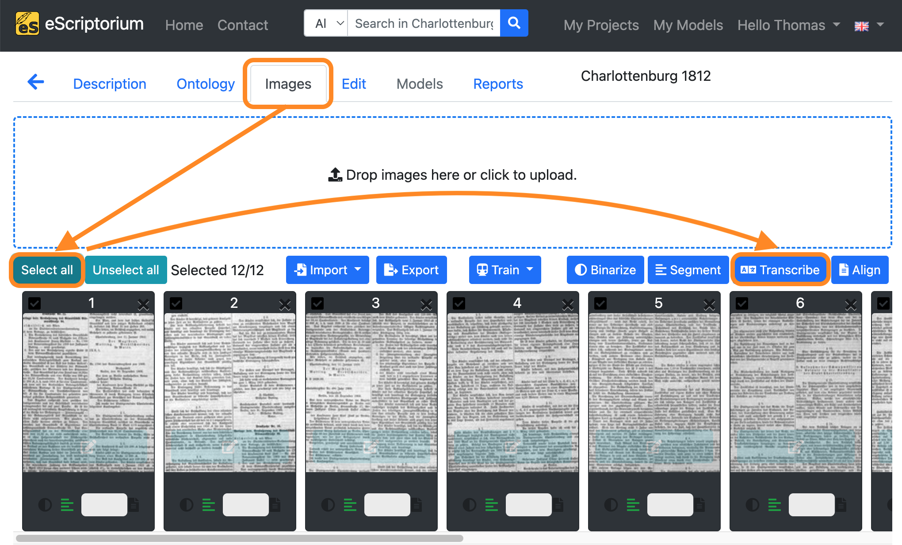
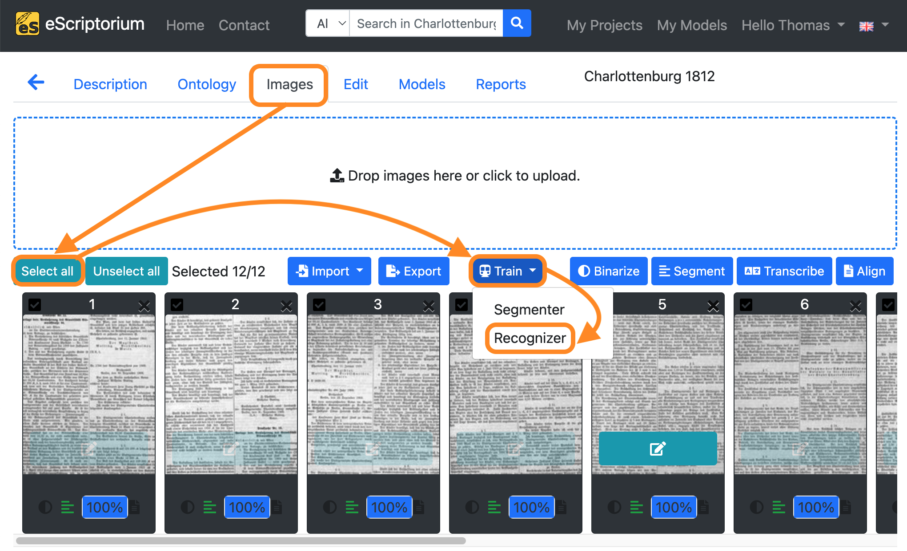
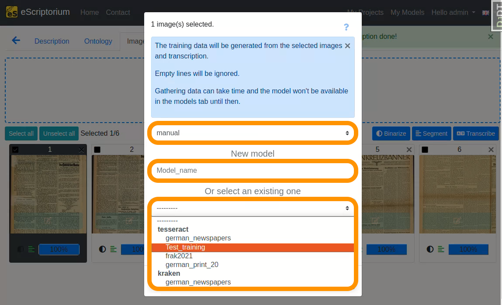
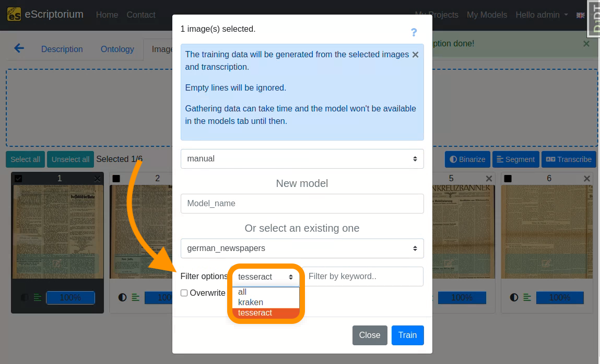
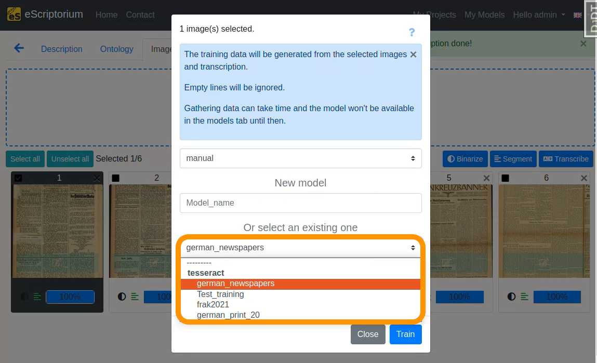
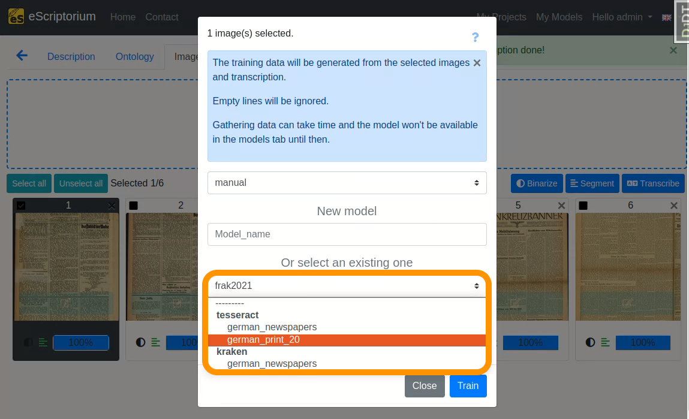

# eScriptorium with Tesseract extension (*a step-by-step guide*)
**version 1.0 | January 2024**

"Tesseract is an open source text recognition (OCR) Engine, available under the Apache 2.0 license. [..] Tesseract can be used directly via command line, or (for programmers) by using an API to extract printed text from images. It supports a wide variety of languages. Tesseract doesn’t have a built-in GUI, but there are several available from the 3rdParty page. External tools, wrappers and training projects for Tesseract are listed under AddOns."[[Tesseract-OCR](https://tesseract-ocr.github.io/tessdoc/)]

Tesseract serves as an important OCR-engine within the OCR-D project. Although it is supported by various third-party GUI extensions, there currently isn't a transcription platform offering training options that support it.

The following step-by-step guide provides an introduction to the installation and the use of eScriptorium with tesseract.

# Contents
0. [Who is this guide for?](#0-who-is-this-guide-for)<br/>
1. [How does training work?](#1-how-does-training-work)<br/>
2. [How to train in eScriptorium?](#2-how-to-train-in-escriptorium)<br/>
2.1. [Provide or create training data (ground truth)](#21-provide-or-create-training-data-ground-truth)<br/>
2.2. [Where to find models](#22-where-to-find-models)<br/>
2.3. [How to choose a model for a specific use case](#23-how-to-choose-a-model-for-a-specific-use-case) <br/>
3. [Fine-tuning in eScriptorium](#3-fine-tuning-in-escriptorium) <br/>
3.1. [How to fine-tune a text recognition model](#31-how-to-fine-tune-a-text-recognition-model)<br/>
3.2. [How to fine-tune a layout segmentation model](#32-how-to-fine-tune-a-layout-segmentation-model)<br/>
4. [Training from scratch in eScriptorium](#4-training-from-scratch-in-escriptorium)<br/>
5. [Additional tips](#5-additional-tips)<br/>
5.1. [Using the virtual keyboard in eScriptorium](#51-using-the-virtual-keyboard-in-escriptorium) <br/>
5.2. [Ground truth guidelines for transcriptions](#52-ground-truth-guidelines-for-transcriptions) <br/>
6. [License](#6-license) 

## 0. Who is this guide for?
This guide is for eScriptorium users which want to set up, use and train Tesseract models in eScriptorium. 

> **Note:**
This guide does not provide a basic understanding of the graphical interface and functionality of the platform. 
Here are some resources to get you started:
> - [eScriptorium Quick Start Guide](https://escriptorium.readthedocs.io/en/latest/quick-start/)
> - **Video tutorial** that introduces the main functions and tools can be found on YouTube: [youtube.com/watch?v=aQuwh3OaKqg](https://www.youtube.com/watch?v=aQuwh3OaKqg) (automatically generated subtitles in English are available). 

Although an attempt was made to keep the guide as accessible as possible, certain technical terms could not be avoided. Where these are to be found in the guide, we try to explain them as clearly as possible. 

This extension and the guide was created during the 3rd [OCR-D](https://ocr-d.de/en/) funding phase in the module project [*Workflow for work-specific training based on generic models with OCR-D as well as ground truth enhancement*](https://www.bib.uni-mannheim.de/en/about/projects-of-the-university-library/ocr-d-modelltraining/) (2021–2023) at [Mannheim University Library](https://www.bib.uni-mannheim.de/en/).
The module project was funded by the German Research Foundation (DFG).

**Feedback is always welcome!**
- [Jan Kamlah](https://orcid.org/0000-0002-0417-7562): `jan.kamlah[at]uni-mannheim[dot]de`
- [Thomas Schmidt](https://orcid.org/0000-0003-3620-3355): `thomas.schmidt[at]uni-mannheim[dot]de`

## 1. How to install and set up eScriptorium and the Tesseract extension

There are only a few deviations from the installation process of the pure eScriptorium software. 
Before you can start the eScriptorium installation, you need to first install the Tesseract software, and then initiate the installation of eScriptorium.

> **Note:** For now, only the full install path is available. 
> A docker image is planned if the extension is not merged.

### 1.1. Installation of Tesseract
Until the changes of Tesseract aren't merged into the official version, you need to compile a modified tesseract version.

Preparation
```
sudo apt-get install g++ # or clang++ (presumably)
sudo apt-get install autoconf automake libtool
sudo apt-get install pkg-config
sudo apt-get install libpng-dev
sudo apt-get install libjpeg8-dev
sudo apt-get install libtiff5-dev
sudo apt-get install zlib1g-dev
sudo apt-get install libwebpdemux2 libwebp-dev
sudo apt-get install libopenjp2-7-dev
sudo apt-get install libgif-dev
sudo apt-get install libarchive-dev libcurl4-openssl-dev
sudo apt-get install libicu-dev
sudo apt-get install libpango1.0-dev
sudo apt-get install libcairo2-dev
sudo apt-get install libleptonica-dev
```

Clone the modified Tesseract version
```
git clone https://github.com/JKamlah/tesseract/ -b lstmf-writer --single-branch 
```

Installation (for the make command you can use -j to use multiple jobs)
```
cd tesseract
./autogen.sh
LIBLEPT_HEADERSDIR=$HOME/local/include ./configure \
  --prefix=$HOME/local/ --with-extra-libraries=$HOME/local/lib
make
make install
sudo ldconfig
make training
sudo make training-install
```

If you have any problems in the installation process, 
you can find help in the [official Tesseract compiling documentation](https://tesseract-ocr.github.io/tessdoc/Compiling).

### 1.1. Installation of eScriptorium with Tesseract extensions
At this point, a modified version of eScriptorium must be installed.

There are several guides how to install eScriptorium:
- [eScriptorium's full install instructions (english)](https://gitlab.com/scripta/escriptorium/-/wikis/full-install)
- [Full install instructions (german) ](./Lokale_Installation_eScriptorium.md)

Since further improvements are still being made to these installation instructions, 
it is recommend using one of the above guides for the installation and only instead of cloning the current eScriptorium repository,
simply run the following command:
```
git clone https://github.com/JKamlah/eScriptorium/ -b extension-tesseract --single-branch 
```

## 2. How to use eScriptorium with Tesseract extension
The application of eScriptorium does not change fundamentally. 
All functions are still available, but the user is now able to upload, apply, train, and export Tesseract models. 
The uploading of images, the initiation of processes, and the transcription functionality remain the same.
The Tesseract extension does not add additional functionality for layout recognition.

### 2.1 What to consider applying Tesseract models to Kraken segmented data?
Since Tesseract's text recognition models heavily rely on the appropriate text line masks, 
it is sometimes necessary to modify the corresponding text lines.
This can be done manually, by training a new layout recognition model
or by applying an external program.

A possible solution would be [PagePlus](https://github.com/JKamlah/pageplus). 
It assists users in optimizing their documents for training, recognition and information extraction. 
However, these optimizations of the documents are not only advantageous or necessary for recognition with Tesseract, but also often with Kraken.

## 3. How to fetch and upload a Tesseract transcription model

### 3.1. Where to find Tesseract models 
Especially for fine-tuning already existing text recognition models are needed. 

> **Note:** Tesseract provides two kinds of text recognition models: **best** and **fast**.
> While only the best models can be fine-tuned, 
> the fast models are smaller and faster.
>
> TL;DR: **Only best models can be fine-tuned!**

Here is a list of places where `tesseract` models can be found:

- **GitHub Tesseract Repository**: [Tesseract best models](https://github.com/tesseract-ocr/tessdata_best)
- **Models by University Library of Mannheim**: [UBMA Tesseract & Kraken models](https://ub-backup.bib.uni-mannheim.de/~stweil/tesstrain/)
- **Zenodo**: [zenodo.org/communities/ocr_models](https://zenodo.org/communities/ocr_models)

### 3.2. How to choose a model for a specific use case
The performance of a model depends on various factors and must be tested for each use case. For example a model trained only on traditional Chinese characters might not perform well on German documents printed in the typeface Fraktur.

Here are some points for orientation that can help with the assessment of a model:
- Has the model been trained on **printed work** or **handwritten** documents?
- Which **languages** (e.g. English, German, Hebrew ...) and **writing systems** (e.g. Latin, Arabic, Chinese ...) does the model cover?
- Which **historical period** and which **historical typefaces** does the model cover? (i.e. is the model suitable for recognising Fraktur fonts, for example?)

> **Note:** As a rule of thumb try testing **generic models** first for your use case. *Generic* or *base models* are usually trained on a wide variety of data (different documents, typefaces etc.) of a specific domain (e.g. printed documents in French of the 18th century). If the model name and description somewhat fits the use case at hand, try testing that generic model first.

### 3.3. How to upload Tesseract models to eScriptorium 

All downloaded models can be uploaded to eScriptorium by clicking on **"My Models"** on the upper right corner of the screen. Click on **"Upload a model"** in the next screen and choose the model you want to upload.


## 4. How to apply a tesseract transcription model to your dataset

To apply a the `tesseract` transcription model:

1. Click on the **"Images"** tab.
2. Click on the **"Select all"** button.
3. Click on the blue **"Transcribe"** button.
4. Select a **"Model"** with the first dropdown menu .<br/>

<br/>

A pop-up should open, that looks like this:

<br/>


## 5. How to train a tesseract transcription model

Tesseract only allows training models for the OCR / transcribing tasks.
With eScriptorium the Tesseract OCR models can be trained in just a few clicks. 

New models can be trained (`training from scratch`) and existing models can be fine-tuned (`fine-tuning`) for specific use cases or domains. The training of OCR models is often carried out via the command line and requires appropriate knowledge. Since eScriptorium provides a graphical user interface, users without command line knowledge can also carry out trainings.
It is necessary to understand the area of application of the two training variants mentioned:

- **`Training from scratch`**: The training of a completely new model (that is not based on an already existing model) is called *training from scratch*. So-called *ground truth* is used for training, e.g. images of book pages with corresponding transcriptions that capture the text content of the pages. In order to generate robust OCR models with a training from scratch, a large amount of data is usually required (sometimes several hundred thousand lines of text). This amount can lead to problems with eScriptorium. For example, an eScriptorium project that is to be used for training from scratch with several thousand digitised documents and transcriptions can reach memory and usability limits. In such cases, training from scratch outside of eScriptorium via command line is recommended. 
- **`Fine-tuning`**: Fine-tuning, or work-specific fine-tuning, involves taking an existing model and specifically adapting it to a new use case or domain (*work-specific* in this context means that the fine-tuning is undertaken with a specific work (e.g. a historical document, manuscript or book) or group of similar works in mind). For example, a basic OCR model trained to recognize standard alphanumeric Latin characters can be unable to identify currency symbols like the Euro (€), Pound (£), or Yen (¥). To fine-tune this model for a financial domain, additional training is done using a dataset that includes these specific currency symbols. This process adjusts the model's parameters to become more sensitive to these new symbols, enabling it to accurately recognize and interpret them in financial documents where they frequently appear.

In many cases, `fine-tuning` can be a time- and resource-efficient method for improving an existing 
text recognition model for a new use case. In order to carry out fine-tuning, an existing model is required, 
which is adapted to the new use case during the fine-tuning training process.

The first steps in the training process are the same as by the `kraken` models:

### 5.1 Provide or create training data (ground truth)
These steps are the same as for the [kraken](Training-with-eScriptorium.md#3-fine-tuning-in-escriptorium) models:

1. [Create a new project and document](Training-with-eScriptorium.md#step-1-create-a-new-project-and-document)
2. [Import your images](Training-with-eScriptorium.md#step-2-import-your-images) 
3. [Run layout segmentation on your data](Training-with-eScriptorium.md#step-3-run-layout-segmentation-on-your-data) 
4. [Check the layout segmentation](Training-with-eScriptorium.md#step-4-check-the-layout-segmentation) 
5. [Correct the text regions](Training-with-eScriptorium.md#step-5-correct-the-text-regions) 
6. [Correct the baselines and line masks](Training-with-eScriptorium.md#step-6-correct-the-baselines-and-line masks)
7. [Correct the layout segmentation for all pages](Training-with-eScriptorium.md#step-7-correct-the-layout-segmentation-for-all-pages)
8. [Run text recognition on your data](Training-with-eScriptorium.md#step-8-run-text-recognition-on-your-data)
9. [Check the transcriptions](Training-with-eScriptorium.md#step-9-check-the-transcriptions)
10. [Improve the transcriptions and create ground truths](Training-with-eScriptorium.md#step-10-improve-the-transcriptions-and-create-ground-truths) 

> **Note:**
> If no base model is available for steps 3 and 8, these steps can also be carried out manually. However, experience shows that working with a model is usually much quicker.

#### Addendum 1: How much training data (ground truth) do I need?
> Experience has shown that even a **small amount of training data** is enough to start fine-tuning an existing text recognition model that already works somewhat well on your data. With regard to fine-tuning, an **iterative approach** should be followed: 
> 1. Create 2 to 3 pages of training data by correcting the automatically generated transcriptions as shown in step 10. 
> 2. [Fine-tune the text recognition model](#step-11-fine-tune-a-text-recognition-model) you have used in step 8 with the corrected ground truth . 
> 3. Test and evaluate if the fine-tuned model yields better transcriptions on your data than before.
> 4. If not, repeat 1 to 3 to create more training data. Fine-tune new models and evaluate them on your data until the results are satisfactory. 
>
> An **example workflow** with iterations can look like this:
> 1. Create 2 pages of training data by correcting transcriptions generated by a text recognition model
> 2. Fine-tune the text recognition model you have already used with those 2 pages of training data
> 3. Evaluate if the fine-tuned model produces better transcriptions
> 4. If the results are better but still need improvement, create additional training data, e.g. another 4 pages 
> 5. Fine-tune the first model again with your 6 pages of ground truth
> 6. Evaluate if the second fine-tuned model produces better transcriptions
> 7. Continue by iterating ...
>
> **Note:** At first glance this process looks time consuming, as you have to repeat certain steps – creating of training data, training itself, evaluation – again. Although this is true, iteration can ultimately lead to a rapid improvement of the generated transcripts, as the fine-tuned models get better with each training and thus generate fewer transcription errors that need to be improved.

#### Addendum 2: Always follow transcription guidelines!
> Transcription guidelines are a set of rules and instructions provided to individuals who are manually transcribing or annotating text from various sources. These guidelines serve to standardize the transcription process, ensuring consistency, accuracy, and clarity in the resulting transcribed data. Guidelines should be used for both the creation and correction of transcriptions. Refer to the chapter [Ground truth guidelines for transcriptions](#52-ground-truth-guidelines-for-transcriptions) to learn more.

#### Step 11: Fine-tune a text recognition model

If you have created a sufficient amount of training data (refer to section [How much training data (ground truth) do I need for fine-tuning?](#how-much-training-data-ground-truth-do-i-need-for-fine-tuning)), the fine-tuning process itself is simple.

1. Click on the **"Images"** tab.
2. Click on the **"Select all"** button.
3. Click on the blue **"Train"** button.
4. Click on **"Recognizer" button.

<br/>

A pop-up should open, that looks like this:

<br/>

- **1st drop-down**: Choose the "manual" transcription where you saved the corrected ground truth
- **Field `New model`**: Choose a name for your fine-tuned model
   - *We recommend using descriptive names, that should capture the following information (as this helps later when identifying a model in a large number of other models)*:
      - `Name of parent model`: name of the model you fine-tune.
      - `Name of the documents you train with`: a descriptive name for identifying the data you used for fine-tuning.
      - `Model number`: Record the number or generation of the new model. `M1`, as in the example, means: the first fine-tuned model.
- **2nd drop-down**: Select the text recognition model you want to fine-tune. This should be the model you worked with in [step 8](#step-8-run-text-recognition-on-your-data), i.e. the text recognition model that already worked quite well on your data. In our example this model is `german_newspapers`.

The model selection can be filtered by:
1. OCR-Engine
<br/>
<br/>

2. Modelname
<br/>
<br/>

Lastly, click on the blue **"Train"** button to start the fine-tuning. 

A running training is shown as below:

<br/>

If you want to view the training progress, click on **"My models"**:

<br/>

The model you are currently training will appear in this overview. 
By clicking on the button **"Toggle versions"** you can view all currently finished training epochs as well. 
You will be notified as soon as the training has finished.

## 6. License
This guide is licensed under [CC0-1.0](https://creativecommons.org/publicdomain/zero/1.0/deed.en).
